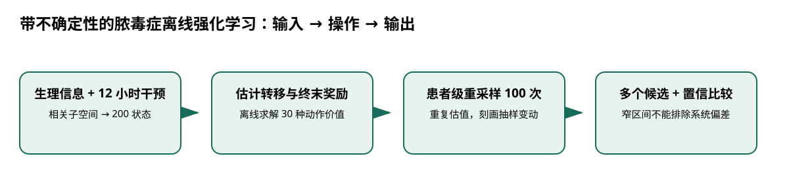

# 带不确定性的脓毒症离线强化学习

> 身份与版本：依据修正后的本地 PDF（arXiv 2107.04491v2）。原报告中若将主题替代论文写成同名原论文，已在本笔记和身份核对文件中明确标注。

> **纳入说明**：本条目经过第一轮身份修复后，按实际论文主题纳入本分类；它并不自动证明老年流感预测有效。

## 核心信息
- 标题: Offline reinforcement learning with uncertainty for treatment strategies in sepsis
- 标题翻译: 带不确定性的脓毒症离线强化学习
- 作者: Ran Liu, Joseph L. Greenstein, James C. Fackler, Jules Bergmann, Melania M. Bembea, Raimond L. Winslow
- 发表时间: 2021-07-09
- 发表渠道: arXiv / 论文版本见本地 PDF
- DOI: 未提供
- arXiv: [2107.04491v2](https://arxiv.org/abs/2107.04491v2)
- 论文链接: https://arxiv.org/abs/2107.04491v2
- 代码 / 项目: 未核实可直接复现本文的官方仓库
- 数据 / 资源: 见“数据与任务定义”
- 论文类型: AI 方法

## 原文摘要翻译
脓毒症及脓毒性休克包含多种危及生命的器官功能障碍，病理机制尚未完全清楚，因此基于指南的治疗困难。早期干预对结局重要，但也可能有副作用且经常过量；没有单一动作适合所有患者，需要更个体化的方法。本文提出一种强化学习应用，从数据中识别治疗建议，估计置信度，并识别训练数据中少见的选项。方法可以提供多个治疗选项，而非单一建议。对学到的策略进行检查后，我们发现由于死亡率与治疗强度存在混杂，强化学习会偏向避免积极干预。我们利用子空间学习减轻这一偏差，并提出可用于其他医疗应用的策略学习方法。

## 创新点
- **方法或组织贡献**：将所有不确定性藏在单一最优动作里容易产生误导。本文同时处理状态表示、行为覆盖和动作价值置信度，展示回顾性治疗策略为何可能学到错误相关性。
- **可复用部分**：### 状态表示为何影响策略
若休克与非休克患者在聚类中混合，治疗强度与死亡之间的关系可能被误学为“治疗导致更差结局”。
- **边界提醒**：论文的结论只适用于下文的数据、任务和评估协议。

## 一句话总结
将所有不确定性藏在单一最优动作里容易产生误导。本文同时处理状态表示、行为覆盖和动作价值置信度，展示回顾性治疗策略为何可能学到错误相关性。

## 研究问题
将所有不确定性藏在单一最优动作里容易产生误导。本文同时处理状态表示、行为覆盖和动作价值置信度，展示回顾性治疗策略为何可能学到错误相关性。

## 数据与任务定义
| 项目 | 设置 |
|---|---|
| 数据 | MIMIC-III，21189 次 ICU 入住、335703 条转移 |
| 时间尺度 | 4 小时 |
| 状态 | 生理信息和过去 12 小时干预，经典型相关分析后聚为 200 类 |
| 动作 | 5 档液体 × 6 档升压药，共 30 种 |
| 奖励 | 生存/死亡终末 ±1；另考察中间死亡风险指标 |
| 不确定性 | 按患者重采样 100 次；动作价值比较及多重检验校正 |

p.5–10、33。输出是动作价值及不确定性，不是发病率预测。

## 方法主线
### 机制流程

> 图：本文依据原文输入—机制—输出关系重绘；用于解释流程，不替代原论文结果图。

图中四个框分别对应原文的输入、变换/学习、输出和评估；箭头表达数据或证据的实际流向，不代表额外的因果保证。

1. **输入生理指标与治疗历史**：输入生理指标与治疗历史，用典型相关分析寻找与干预及结局相关的子空间，再聚类形成离散状态。
2. **从观察轨迹估计状态转移与奖励**：从观察轨迹估计状态转移与奖励，求解候选动作的价值和策略。
3. **以患者为单位重复重采样并重估模型**：以患者为单位重复重采样并重估模型，获得动作价值的变化范围。
4. **比较动作价值的统计差异**：比较动作价值的统计差异，保留无法明显排除的多个候选动作，并标记低覆盖区域。

### 模型、公式与关键实现
### 状态表示为何影响策略
若休克与非休克患者在聚类中混合，治疗强度与死亡之间的关系可能被误学为“治疗导致更差结局”。加入过去干预和相关子空间有助于区分人群，但不等于识别了因果效应。

### 置信度的含义
重复重采样衡量有限样本下的变动；单侧检验和校正使“某动作较差”的判定更严格。即便每次重采样都重复同一偏差，置信区间也可能很窄，原文明确讨论这一问题。

## 关键结果
| 结果 | 正确解释 |
|---|---|
| 69.9% 的医生观察动作被判次优，置信水平 99% | 在论文状态、转移与奖励模型内的标签 |
| 学习策略价值高于医生、随机和不干预基线，报告 p<0.01 | 学习模型内的价值比较 |
| 子空间减轻休克/非休克混合 | 表示方式影响策略偏好 |

p.8–10、18、25。上述数字不能改写成 69.9% 的真实诊疗错误，也不是临床死亡率下降。

## 深度分析
比仅返回动作的网络更可审查：不确定性和多候选输出揭示了证据不足的地方。相较第12篇，离散状态便于检查，但聚类引入额外信息损失。作者识别到治疗—病情混杂是价值所在；修正表示只能减轻其中可观测部分。

### 与老年人流感预测的关系
借鉴“同时报告点估计与证据不足区域”的思想，而非移植治疗动作。对于流感预测，分别量化采样不确定性、监测回填与跨地区偏差；不要把自助法区间当作完整可信度。

## 局限
重采样无法检测系统偏差、未测量病情或错误状态转移。固定聚类数和动作分档影响结果；不同医院的治疗习惯也会改变覆盖。没有前瞻随机验证。

## 我的笔记
- 先固定论文版本、数据发布日期、患者/地区时间切分和随机种子，再比较模型。
- 所有迁移实验同时报告总体与 65+、75+ 分层；预测模型报告 MAE/WIS、覆盖率、峰值误差和提前量。
- 医疗强化学习论文中的动作策略、代理奖励和 OPE 不能替代流感数值预测的概率损失；如引入决策，另建 CMDP 与安全评估。

## 引用
- 原始论文：[Offline reinforcement learning with uncertainty for treatment strategies in sepsis](https://arxiv.org/abs/2107.04491v2)，arXiv:2107.04491v2。
- 本地逐页证据：`../检索记录/14_pages.txt`；关键页码：5, 6, 8, 9, 10, 18, 25, 33。
