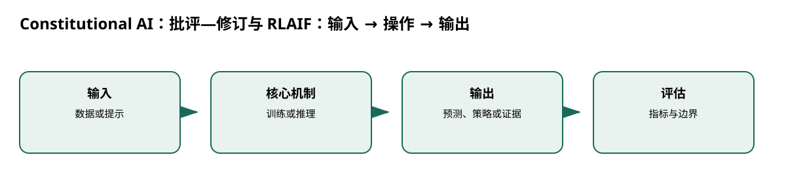

# Constitutional AI：批评—修订与 RLAIF

> 身份与版本：依据修正后的本地 PDF（arXiv 2212.08073v1）。原报告中若将主题替代论文写成同名原论文，已在本笔记和身份核对文件中明确标注。

> **纳入说明**：本条目经过第一轮身份修复后，按实际论文主题纳入本分类；它并不自动证明老年流感预测有效。

## 核心信息
- 标题: Constitutional AI: Harmlessness from AI Feedback
- 标题翻译: Constitutional AI：批评—修订与 RLAIF
- 作者: Yuntao Bai, Saurav Kadavath, Sandipan Kundu, Amanda Askell, Jackson Kernion, Andy Jones, Anna Chen, Anna Goldie 等
- 发表时间: 2022-12-15
- 发表渠道: arXiv / 论文版本见本地 PDF
- DOI: 未提供
- arXiv: [2212.08073v1](https://arxiv.org/abs/2212.08073v1)
- 论文链接: https://arxiv.org/abs/2212.08073v1
- 代码 / 项目: [https://github.com/anthropics/ConstitutionalHarmlessnessPaper](https://github.com/anthropics/ConstitutionalHarmlessnessPaper)
- 数据 / 资源: 见“数据与任务定义”
- 论文类型: AI 方法

## 原文摘要翻译
本文通过一组规则或原则监督 AI，探索在不使用识别有害输出的人类标签时训练无害助手。监督阶段让初始模型自我批评和修订，再用修订回答微调；强化阶段由 AI 比较两个回答，训练偏好模型，再用 AI 反馈进行强化学习。结果是无害但不过度回避的助手；帮助性仍混合使用人类反馈。

## 创新点
- **方法或组织贡献**：能否把明确原则转为可扩展的批评和偏好信号，减少逐条人工有害性标注？
- **可复用部分**：原则是奖励规范的外显接口，但 AI 判断也会带来自洽偏差；链式推理提高透明度不等于事实正确。
- **边界提醒**：论文的结论只适用于下文的数据、任务和评估协议。

## 一句话总结
能否把明确原则转为可扩展的批评和偏好信号，减少逐条人工有害性标注？

## 研究问题
能否把明确原则转为可扩展的批评和偏好信号，减少逐条人工有害性标注？

## 数据与任务定义
主模型 52B；有害提示、宪法原则和 few-shot 示例；监督批评—修订—SFT，随后 AI 比较—偏好模型—RLAIF（p.1,5）。

## 方法主线
### 机制流程

> 图：本文依据原文输入—机制—输出关系重绘；用于解释流程，不替代原论文结果图。

图中四个框分别对应原文的输入、变换/学习、输出和评估；箭头表达数据或证据的实际流向，不代表额外的因果保证。

1. **输入有害提示与原则**：输入有害提示与原则，生成初始回答及批评文本。
2. **按原则自我修订**：按原则自我修订，构建修订数据并监督微调。
3. **对两个候选回答进行 AI 比较**：对两个候选回答进行 AI 比较，形成偏好数据并训练偏好模型。
4. **以偏好模型为奖励做 RL**：以偏好模型为奖励做 RL，评估有害性与帮助性的权衡。

### 模型、公式与关键实现
原则是奖励规范的外显接口，但 AI 判断也会带来自洽偏差；链式推理提高透明度不等于事实正确。

## 关键结果
相同帮助性下有害性下降；重复修订和链式批评有增益（p.3,5）。

## 深度分析
“无人工有害标签”不等于无人类监督：原则由人给出，帮助性仍有人类数据。医疗安全、老年公平和预测校准不在原则内。

### 与老年人流感预测的关系
[1, 3, 5]

## 局限
可借鉴把安全约束写成可审核规则，但流感项目更需要数据和预测区间校准，而非把宪法原则当奖励。

## 我的笔记
- 先固定论文版本、数据发布日期、患者/地区时间切分和随机种子，再比较模型。
- 所有迁移实验同时报告总体与 65+、75+ 分层；预测模型报告 MAE/WIS、覆盖率、峰值误差和提前量。
- 医疗强化学习论文中的动作策略、代理奖励和 OPE 不能替代流感数值预测的概率损失；如引入决策，另建 CMDP 与安全评估。

## 引用
- 原始论文：[Constitutional AI: Harmlessness from AI Feedback](https://arxiv.org/abs/2212.08073v1)，arXiv:2212.08073v1。
- 本地逐页证据：`../检索记录/16_pages.txt`；关键页码：['原则 + 提示', '生成回答'], ['自我批评', '修订回答'], ['AI 两两比较', '偏好模型'], ['RLAIF', '无害性—帮助性评估']。
