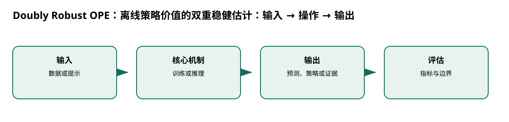

# Doubly Robust OPE：离线策略价值的双重稳健估计

> 身份与版本：依据修正后的本地 PDF（arXiv 1511.03722v3）。原报告中若将主题替代论文写成同名原论文，已在本笔记和身份核对文件中明确标注。

> **纳入说明**：本条目经过第一轮身份修复后，按实际论文主题纳入本分类；它并不自动证明老年流感预测有效。

## 核心信息
- 标题: Doubly Robust Off-policy Value Evaluation for Reinforcement Learning
- 标题翻译: Doubly Robust OPE：离线策略价值的双重稳健估计
- 作者: Nan Jiang, Lihong Li
- 发表时间: 2015-11-11
- 发表渠道: arXiv / 论文版本见本地 PDF
- DOI: 未提供
- arXiv: [1511.03722v3](https://arxiv.org/abs/1511.03722v3)
- 论文链接: https://arxiv.org/abs/1511.03722v3
- 代码 / 项目: 未核实可直接复现本文的官方仓库
- 数据 / 资源: 见“数据与任务定义”
- 论文类型: AI 方法

## 原文摘要翻译
本文研究离线强化学习中的异策略价值评估：用一个行为策略收集的数据估计新策略价值。既有方法要么偏差不可控，要么方差很高。作者将 bandit 的双重稳健估计扩展到序贯决策，在满足条件时保持无偏，并可能比重要性采样方差更低；实验还展示安全策略改进用途，并给出问题难度下界。

## 创新点
- **方法或组织贡献**：在无法上线试验时，如何用历史轨迹评估新策略，并同时降低模型误差和重要性采样方差？
- **可复用部分**：形式为 $V_{DR,t}=\hat V(s_t)+
ho_t[r_t+\gamma V_{DR,t+1}-\hat Q(s_t,a_t)]$。
- **边界提醒**：论文的结论只适用于下文的数据、任务和评估协议。

## 一句话总结
在无法上线试验时，如何用历史轨迹评估新策略，并同时降低模型误差和重要性采样方差？

## 研究问题
在无法上线试验时，如何用历史轨迹评估新策略，并同时降低模型误差和重要性采样方差？

## 数据与任务定义
离线轨迹、行为策略与评估策略；MountainCar horizon 100，训练 2000、评估 5000；另有 Sailing；交叉拟合 2 折（p.3–7）。

## 方法主线
### 机制流程

> 图：本文依据原文输入—机制—输出关系重绘；用于解释流程，不替代原论文结果图。

图中四个框分别对应原文的输入、变换/学习、输出和评估；箭头表达数据或证据的实际流向，不代表额外的因果保证。

1. **输入历史轨迹**：输入历史轨迹，独立估计行为策略比率和状态动作价值模型。
2. **沿轨迹用时点重要性比率修正模型预测与真实奖励的差异。**：沿轨迹用时点重要性比率修正模型预测与真实奖励的差异。
3. **递归计算双重稳健估值：模型基线 + 比率 ×（即时奖励 + 下一值 − 模型 Q）。**：递归计算双重稳健估值：模型基线 + 比率 ×（即时奖励 + 下一值 − 模型 Q）。
4. **在基准环境比较 IS、WIS、模型回归和 DR**：在基准环境比较 IS、WIS、模型回归和 DR，并评估方差。

### 模型、公式与关键实现
形式为 $V_{DR,t}=\hat V(s_t)+
ho_t[r_t+\gamma V_{DR,t+1}-\hat Q(s_t,a_t)]$。若行为覆盖或价值模型条件不满足，不能保证实际无偏。

## 关键结果
DR 在部分中间训练集切分优于 IS，bad-Q 或随机动力学仍会产生较大方差（p.7）。

## 深度分析
双重稳健不是对未观测混杂的万能修正；医疗轨迹还需要可识别性、行为覆盖和时间顺序。

### 与老年人流感预测的关系
[3, 4, 6, 7]

## 局限
预测项目不需要 OPE；只有把模型输出变成资源或治疗动作时，才将 DR 作为离线评估组件并报告敏感性。

## 我的笔记
- 先固定论文版本、数据发布日期、患者/地区时间切分和随机种子，再比较模型。
- 所有迁移实验同时报告总体与 65+、75+ 分层；预测模型报告 MAE/WIS、覆盖率、峰值误差和提前量。
- 医疗强化学习论文中的动作策略、代理奖励和 OPE 不能替代流感数值预测的概率损失；如引入决策，另建 CMDP 与安全评估。

## 引用
- 原始论文：[Doubly Robust Off-policy Value Evaluation for Reinforcement Learning](https://arxiv.org/abs/1511.03722v3)，arXiv:1511.03722v3。
- 本地逐页证据：`../检索记录/18_pages.txt`；关键页码：['历史轨迹', '行为 / 评估策略'], ['模型价值 + 比率', '交叉拟合'], ['逐步 DR 递归', '残差校正'], ['多估计器比较', '偏差—方差']。
