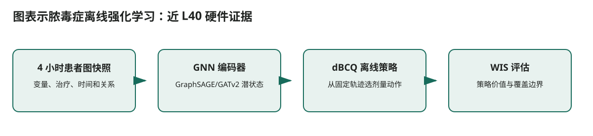

# 图表示脓毒症离线强化学习：近 L40 硬件证据

## 核心信息
- 标题: Exploring a Graph-based Approach to Offline Reinforcement Learning for Sepsis Treatment
- 年份: 2025，EWRL
- 论文链接: https://arxiv.org/abs/2509.03393
- 代码 / 项目: 论文未定位官方代码仓库。
- 证据来源: [第二轮调研 S005；全文 p.4–10](../../调研证据/证据/2509.03393.pdf)

## 原文摘要翻译
本文将 MIMIC-III 脓毒症患者的时间戳数据表示为动态异构图，用 GraphSAGE 或 GATv2 编码患者状态，再以 dBCQ 学习离线治疗策略。研究重点是图表示对策略学习的影响，而不是设计新的临床奖励。

## 创新点
复杂医疗记录能否用动态异构图编码，使离线 BCQ 比传统向量状态更有效？

## 一句话总结
复杂医疗记录能否用动态异构图编码，使离线 BCQ 比传统向量状态更有效？

## 研究问题
复杂医疗记录能否用动态异构图编码，使离线 BCQ 比传统向量状态更有效？

## 数据与任务定义
MIMIC-III 脓毒症队列按 4 小时聚合；先训练编码器—解码器预测下一状态，再将潜表示给 dBCQ。作者报告使用三张 46GB L40，BCQ GPU 训练约 2.5 小时，GNN 自动编码器约 30 小时。

## 方法主线
### 输入输出流

> 图：依据本文实际的数据流和模块关系重绘；箭头表示计算或证据传递，不表示未经验证的临床因果关系。

1. **4 小时患者图快照**：变量、治疗、时间和关系
2. **GNN 编码器**：GraphSAGE/GATv2 潜状态
3. **dBCQ 离线策略**：从固定轨迹选剂量动作
4. **WIS 评估**：策略价值与覆盖边界

### 模型与训练机制
表示学习与策略学习分离：编码器与解码器用下一状态预测训练；冻结后把潜状态输入 Q 网络。WIS 通过目标与行为策略的概率比加权回报，依赖行为策略估计和支持集覆盖。

## 关键结果
GNN 表示可以形成具有竞争力的 WIS 曲线，但编码器重构误差与下游策略 WIS 不严格对应。作者也承认只用 MIMIC-III，WIS 的临床意义有限。

## 深度分析
单数据集、回顾性 WIS、行为策略估计误差和未观测混杂都限制结论；不包含可迁移的奖励函数创新。

## 局限
它为双 L40 附近的离线 RL 开销提供最具体的证据，适合先估算工程预算。对流感工作，只在将预测转为资源配置行动后才需要这类状态—动作建模。

## 我的笔记
- 复现时固定数据版本、预测时点、训练/验证/测试的时间边界和随机种子。
- 双 L40 只作为后训练资源条件；记录每张卡的峰值显存、序列长度、精度和可训练参数比例。
- 对医疗结果同时报告性能、校准、覆盖和数据覆盖边界，不能仅用单一分数判断可部署性。

## 引用
[第二轮调研 S005；全文 p.4–10](../../调研证据/证据/2509.03393.pdf)
