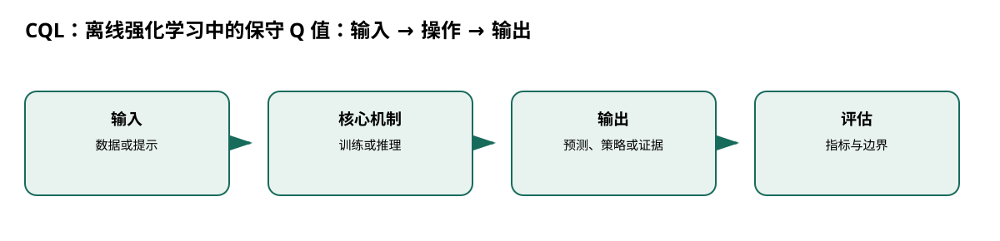

# CQL：离线强化学习中的保守 Q 值

> 身份与版本：依据修正后的本地 PDF（arXiv 2006.04779v3）。原报告中若将主题替代论文写成同名原论文，已在本笔记和身份核对文件中明确标注。

> **纳入说明**：本条目经过第一轮身份修复后，按实际论文主题纳入本分类；它并不自动证明老年流感预测有效。

## 核心信息
- 标题: Conservative Q-Learning for Offline Reinforcement Learning
- 标题翻译: CQL：离线强化学习中的保守 Q 值
- 作者: Aviral Kumar, Aurick Zhou, George Tucker, Sergey Levine
- 发表时间: 2020-06-08
- 发表渠道: arXiv / 论文版本见本地 PDF
- DOI: 未提供
- arXiv: [2006.04779v3](https://arxiv.org/abs/2006.04779v3)
- 论文链接: https://arxiv.org/abs/2006.04779v3
- 代码 / 项目: [https://github.com/aviralkumar2907/CQL](https://github.com/aviralkumar2907/CQL)
- 数据 / 资源: 见“数据与任务定义”
- 论文类型: AI 方法

## 原文摘要翻译
离线强化学习从固定数据学习策略，但分布外动作会造成价值高估。CQL 在 Bellman 误差外加入 Q 值正则，使策略在学习到的 Q 函数下具有保守的价值下界，并给出策略改进理论保证。在离散和连续控制上，尤其在混合、多模态数据分布中，CQL 常显著超过既有离线方法。

## 创新点
- **方法或组织贡献**：如何在没有新交互数据时避免 Q 学习对数据未覆盖动作过度乐观？
- **可复用部分**：核心项可写为 $lpha(E_{a\sim\mu}Q-E_{a\sim D}Q)+
rac12E_D(Q-\hat B^\pi Q_k)^2$。
- **边界提醒**：论文的结论只适用于下文的数据、任务和评估协议。

## 一句话总结
如何在没有新交互数据时避免 Q 学习对数据未覆盖动作过度乐观？

## 研究问题
如何在没有新交互数据时避免 Q 学习对数据未覆盖动作过度乐观？

## 数据与任务定义
D4RL Gym 连续控制、Adroit 机器人和图像/离散控制；actor-critic CQL 使用 SAC 风格实现，也有 QR-DQN 版本。实验比较 SAC、BC、BEAR、BRAC 等（p.3,7–9）。

## 方法主线
### 机制流程

> 图：本文依据原文输入—机制—输出关系重绘；用于解释流程，不替代原论文结果图。

图中四个框分别对应原文的输入、变换/学习、输出和评估；箭头表达数据或证据的实际流向，不代表额外的因果保证。

1. **输入固定离线状态—动作—奖励—下一状态数据。**：输入固定离线状态—动作—奖励—下一状态数据。
2. **Bellman 误差拟合数据动作的目标 Q**：Bellman 误差拟合数据动作的目标 Q，同时对指定动作分布的 Q 值加惩罚。
3. **可用 log-sum-exp 近似所有动作的高 Q**：可用 log-sum-exp 近似所有动作的高 Q，减去数据分布动作期望，压低分布外过估计。
4. **策略从保守 Q 中选动作**：策略从保守 Q 中选动作，再用 D4RL 回报评测。

### 模型、公式与关键实现
核心项可写为 $lpha(E_{a\sim\mu}Q-E_{a\sim D}Q)+
rac12E_D(Q-\hat B^\pi Q_k)^2$。定理给出的是期望价值下界，不是每个动作都点态低估；需要行为覆盖等条件。

## 关键结果
D4RL 混合数据中 CQL 常较强，例如 walker2d-medium-expert 98.7 对 SAC 1.9、BC 11.3；但单一数据分布上的优势通常较小（p.8）。

## 深度分析
保守性抑制错误外推，也可能牺牲数据内的改进；医疗状态定义、行为策略混合和安全成本还需另行建模。CQL 不是“少样本临床 RL”论文。

### 与老年人流感预测的关系
[3, 7, 8, 9]

## 局限
作为方法组件，适合资源分配或干预决策的离线基线；不用于直接提升流感预测准确率。

## 我的笔记
- 先固定论文版本、数据发布日期、患者/地区时间切分和随机种子，再比较模型。
- 所有迁移实验同时报告总体与 65+、75+ 分层；预测模型报告 MAE/WIS、覆盖率、峰值误差和提前量。
- 医疗强化学习论文中的动作策略、代理奖励和 OPE 不能替代流感数值预测的概率损失；如引入决策，另建 CMDP 与安全评估。

## 引用
- 原始论文：[Conservative Q-Learning for Offline Reinforcement Learning](https://arxiv.org/abs/2006.04779v3)，arXiv:2006.04779v3。
- 本地逐页证据：`../检索记录/20_pages.txt`；关键页码：['离线转移集', '固定行为覆盖'], ['Bellman 拟合', '数据动作目标'], ['保守 Q 正则', '压低 OOD 动作'], ['策略评估', 'D4RL 回报']。
