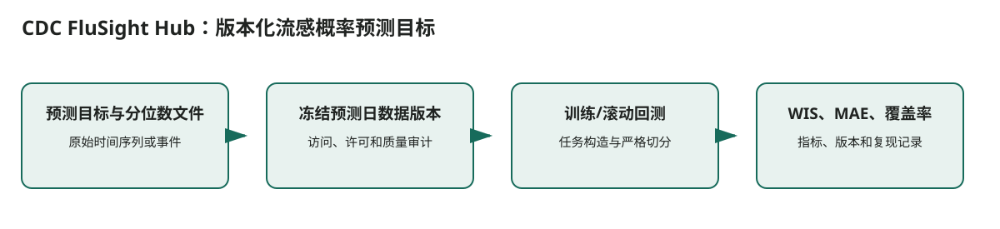

# CDC FluSight Hub：版本化流感概率预测目标

## 核心信息
- 标题: CDC FluSight Forecast Hub
- 获取状态: 公开下载
- 代码 / 项目: https://github.com/cdcgov/FluSight-forecast-hub
- 证据来源: [第二轮调研 S014](../../调研证据/report.md)

## 原文摘要翻译
周度 NHSN 流感住院目标、概率分位数提交和版本化目标数据。

## 创新点
该资源解决的是“CDC FluSight Hub：版本化流感概率预测目标”的数据可获得性与可复现任务定义问题。

## 一句话总结
该资源解决的是“CDC FluSight Hub：版本化流感概率预测目标”的数据可获得性与可复现任务定义问题。

## 研究问题
该资源解决的是“CDC FluSight Hub：版本化流感概率预测目标”的数据可获得性与可复现任务定义问题。

## 数据与任务定义
周度 NHSN 流感住院目标、概率分位数提交和版本化目标数据。

## 方法主线
### 输入输出流

> 图：依据本文实际的数据流和模块关系重绘；箭头表示计算或证据传递，不表示未经验证的临床因果关系。

1. **预测目标与分位数文件**：原始时间序列或事件
2. **冻结预测日数据版本**：访问、许可和质量审计
3. **训练/滚动回测**：任务构造与严格切分
4. **WIS、MAE、覆盖率**：指标、版本和复现记录

### 模型与训练机制
数据集不是模型。关键机制是数据版本、可见时间边界、变量定义和切分规则；这些决定模型结果是否可比较。

## 关键结果
数据集文档提供资源规模或访问状态，而非一篇模型论文的性能排名。使用前应先运行缺失率、时间戳、年龄字段和版本差异审计。

## 深度分析
数据后续修订会造成泄漏；默认目标并非年龄分层。

## 局限
FluSight 是老年流感预测的主目标入口；需另行确认 65+/75+ 分层目标和辅助信号许可。

## 我的笔记
- 复现时固定数据版本、预测时点、训练/验证/测试的时间边界和随机种子。
- 双 L40 只作为后训练资源条件；记录每张卡的峰值显存、序列长度、精度和可训练参数比例。
- 对医疗结果同时报告性能、校准、覆盖和数据覆盖边界，不能仅用单一分数判断可部署性。

## 引用
[第二轮调研 S014](../../调研证据/report.md)
