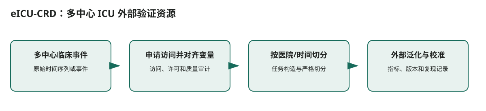

# eICU-CRD：多中心 ICU 外部验证资源

## 核心信息
- 标题: eICU Collaborative Research Database
- 获取状态: 凭证访问、课程与 DUA
- 代码 / 项目: https://physionet.org/content/eicu-crd/
- 证据来源: [第二轮调研 S012](../../调研证据/report.md)

## 原文摘要翻译
多中心 ICU EHR，可支持跨医院泛化和医院异质性分析。

## 创新点
该资源解决的是“eICU-CRD：多中心 ICU 外部验证资源”的数据可获得性与可复现任务定义问题。

## 一句话总结
该资源解决的是“eICU-CRD：多中心 ICU 外部验证资源”的数据可获得性与可复现任务定义问题。

## 研究问题
该资源解决的是“eICU-CRD：多中心 ICU 外部验证资源”的数据可获得性与可复现任务定义问题。

## 数据与任务定义
多中心 ICU EHR，可支持跨医院泛化和医院异质性分析。

## 方法主线
### 输入输出流

> 图：依据本文实际的数据流和模块关系重绘；箭头表示计算或证据传递，不表示未经验证的临床因果关系。

1. **多中心临床事件**：原始时间序列或事件
2. **申请访问并对齐变量**：访问、许可和质量审计
3. **按医院/时间切分**：任务构造与严格切分
4. **外部泛化与校准**：指标、版本和复现记录

### 模型与训练机制
数据集不是模型。关键机制是数据版本、可见时间边界、变量定义和切分规则；这些决定模型结果是否可比较。

## 关键结果
数据集文档提供资源规模或访问状态，而非一篇模型论文的性能排名。使用前应先运行缺失率、时间戳、年龄字段和版本差异审计。

## 深度分析
不同医院记录实践不同；不等于社区流感监测。

## 局限
适合验证从 MIMIC 单中心迁移的模型是否稳健。

## 我的笔记
- 复现时固定数据版本、预测时点、训练/验证/测试的时间边界和随机种子。
- 双 L40 只作为后训练资源条件；记录每张卡的峰值显存、序列长度、精度和可训练参数比例。
- 对医疗结果同时报告性能、校准、覆盖和数据覆盖边界，不能仅用单一分数判断可部署性。

## 引用
[第二轮调研 S012](../../调研证据/report.md)
