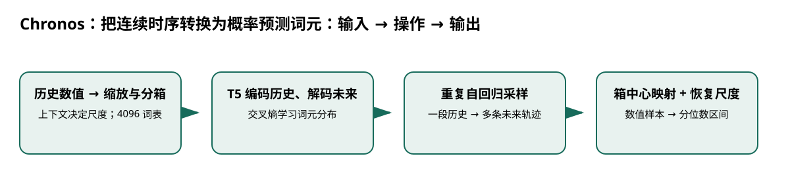

# Chronos：把连续时序转换为概率预测词元

> 身份与版本：依据修正后的本地 PDF（arXiv 2403.07815v3）。原报告中若将主题替代论文写成同名原论文，已在本笔记和身份核对文件中明确标注。

> **纳入说明**：本条目经过第一轮身份修复后，按实际论文主题纳入本分类；它并不自动证明老年流感预测有效。

## 核心信息
- 标题: Chronos: Learning the Language of Time Series
- 标题翻译: Chronos：把连续时序转换为概率预测词元
- 作者: Abdul Fatir Ansari, Lorenzo Stella, Caner Turkmen, Xiyuan Zhang, Pedro Mercado, Huibin Shen, Oleksandr Shchur, Syama Sundar Rangapuram 等
- 发表时间: 2024-03-12
- 发表渠道: arXiv / 论文版本见本地 PDF
- DOI: 未提供
- arXiv: [2403.07815v3](https://arxiv.org/abs/2403.07815v3)
- 论文链接: https://arxiv.org/abs/2403.07815v3
- 代码 / 项目: [https://github.com/amazon-science/chronos-forecasting](https://github.com/amazon-science/chronos-forecasting)
- 数据 / 资源: 见“数据与任务定义”
- 论文类型: AI 方法

## 原文摘要翻译
我们提出 Chronos，一个简单而有效的预训练概率时间序列模型框架。它通过缩放与量化，将时序数值编码为固定词表中的词元，再使用交叉熵损失训练已有的 Transformer 语言模型架构。我们在大量公开数据上预训练了基于 T5 的模型，参数从 2000 万到 7.1 亿，并加入通过高斯过程生成的合成数据来改善泛化。在包含 42 个数据集、传统局部模型及深度学习方法的全面评测中，Chronos 在参与预训练的数据集上显著超过其他方法；在新数据集上，其零样本表现与专门在这些数据上训练的方法相当，有时更好。结果表明，多领域时序可以改善未见预测任务上的零样本准确性，使预训练模型成为简化预测流程的可行工具。

## 创新点
- **方法或组织贡献**：能否把不同领域、量纲和频率的连续序列统一到一个离散预测任务，从而无需为每个数据集单独训练？核心是数值表征的统一，不是利用自然语言语义理解时间序列。
- **可复用部分**：### 数值到词元
令 $s=C^{-1}\sum_{t=1}^{C}|x_t|$，实现中需处理零尺度；离散值为 $z_t=q(x_t/s)$。
- **边界提醒**：论文的结论只适用于下文的数据、任务和评估协议。

## 一句话总结
能否把不同领域、量纲和频率的连续序列统一到一个离散预测任务，从而无需为每个数据集单独训练？核心是数值表征的统一，不是利用自然语言语义理解时间序列。

## 研究问题
能否把不同领域、量纲和频率的连续序列统一到一个离散预测任务，从而无需为每个数据集单独训练？核心是数值表征的统一，不是利用自然语言语义理解时间序列。

## 数据与任务定义
输入单变量历史 $x_{1:C}$，输出未来 $H$ 步的样本轨迹与分位数。训练使用 28 个数据集，评测包含 15 个训练域内和 27 个未见数据集（p.8–10）。

| 项目 | 设置 |
|---|---|
| T5 规模 | 20M / 46M / 200M / 710M |
| 窗口 | 历史 512，预测 64 |
| 词表 / 范围 | 共 4096 项，含填充和结束符；缩放值区间约 -15 到 15 |
| 数据增强 | 10M 条 TSMixup；1M 条高斯过程合成序列；训练采样 9:1 |
| 优化 | 200K 步，批量 256；AdamW，学习率 0.001 线性降至 0，权重衰减 0.01 |
| 原文硬件 | 8 张 40GB A100；这是预训练，不是下游推理要求 |

评价使用加权分位数损失和缩放绝对误差，聚合成绩依赖论文的归一化协议。

## 方法主线
### 机制流程

> 图：本文依据原文输入—机制—输出关系重绘；用于解释流程，不替代原论文结果图。

图中四个框分别对应原文的输入、变换/学习、输出和评估；箭头表达数据或证据的实际流向，不代表额外的因果保证。

1. **输入历史序列**：输入历史序列，仅以可见上下文计算平均绝对值尺度，将历史及训练目标缩放并分箱，输出离散词元。
2. **输入词元序列**：输入词元序列，T5 编码历史、解码未来，以交叉熵训练条件分布；真实混合与合成序列共享该流程。
3. **推理时固定历史**：推理时固定历史，多次自回归采样未来词元，得到多条离散轨迹。
4. **把采样词元映射回箱中心并恢复尺度**：把采样词元映射回箱中心并恢复尺度，输出数值轨迹，进一步汇总中位数与预测区间。

### 模型、公式与关键实现
### 数值到词元
令 $s=C^{-1}\sum_{t=1}^{C}|x_t|$，实现中需处理零尺度；离散值为 $z_t=q(x_t/s)$。训练目标是

$$\mathcal L=-\sum_{h=1}^{H}\log p_	heta(z_{C+h}\mid z_{1:C},z_{C+1:C+h-1}).$$

尺度只用历史估计，若从未来窗口取尺度会引入信息泄漏。预测区间来自模型采样，而不是在点预测上任意加一个百分比。

### 增强为何可迁移
TSMixup 混合若干真实序列，扩大形态变化；KernelSynth 将周期、线性等核随机相加或相乘，再从高斯过程采样。它们补足训练形态，但不能保证真实流感的机制和干预模式也被覆盖。

## 关键结果
| 46M 配置 | 零样本加权分位数损失 | 缩放绝对误差 |
|---|---:|---:|
| 预训练后直接预测 | 0.667 | 0.841 |
| 下游微调 1000 步 | 0.597 | 0.760 |

来源 p.12 图6；按论文聚合协议，越低越好。增强消融中，零样本分位数损失从无增强的 0.735，降至 TSMixup 的 0.709，再到加入 10% 合成数据的 0.667（图10）。它支持增强有用，而非合成比例越大越好。

## 深度分析
这是本项目概率基线的优先候选：小模型、统一接口、直接获得区间。代价是箱宽限制分辨率，词元交叉熵把邻近箱和远箱当不同类别，未显式利用数值距离。有限量化范围和训练形态还会限制趋势外推；原文展示了短历史或指数趋势下的弱点。

### 与老年人流感预测的关系
先比较季节朴素、ETS、Chronos 小模型零样本与同模型微调。固定发布日期可得数据及上下文尺度，报告逐预测期 WIS、MAE 和区间覆盖；记录低发病期分箱误差和峰值低估。

## 局限
原版主要是单变量，无直接年龄、地区或天气协变量接口；不能把后续 Chronos 系列新功能写进本论文。零样本要求目标数据未参与预训练，公共流感序列必须先核对污染。区间采样能表达模型分布，但不保证分年龄覆盖率。

## 我的笔记
- 先固定论文版本、数据发布日期、患者/地区时间切分和随机种子，再比较模型。
- 所有迁移实验同时报告总体与 65+、75+ 分层；预测模型报告 MAE/WIS、覆盖率、峰值误差和提前量。
- 医疗强化学习论文中的动作策略、代理奖励和 OPE 不能替代流感数值预测的概率损失；如引入决策，另建 CMDP 与安全评估。

## 引用
- 原始论文：[Chronos: Learning the Language of Time Series](https://arxiv.org/abs/2403.07815v3)，arXiv:2403.07815v3。
- 本地逐页证据：`../检索记录/08_pages.txt`；关键页码：3, 4, 5, 6, 7, 8, 9, 10, 12, 13, 14。
