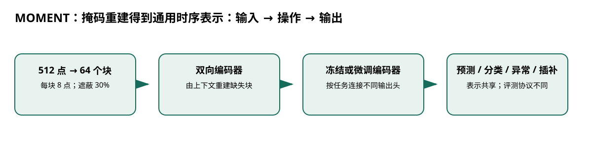

# MOMENT：掩码重建得到通用时序表示

> 身份与版本：依据修正后的本地 PDF（arXiv 2402.03885v3）。原报告中若将主题替代论文写成同名原论文，已在本笔记和身份核对文件中明确标注。

> **纳入说明**：本条目经过第一轮身份修复后，按实际论文主题纳入本分类；它并不自动证明老年流感预测有效。

## 核心信息
- 标题: MOMENT: A Family of Open Time-series Foundation Models
- 标题翻译: MOMENT：掩码重建得到通用时序表示
- 作者: Mononito Goswami, Konrad Szafer, Arjun Choudhry, Yifu Cai, Shuo Li, Artur Dubrawski
- 发表时间: 2024-02-06
- 发表渠道: arXiv / 论文版本见本地 PDF
- DOI: 未提供
- arXiv: [2402.03885v3](https://arxiv.org/abs/2402.03885v3)
- 论文链接: https://arxiv.org/abs/2402.03885v3
- 代码 / 项目: [https://github.com/moment-timeseries-foundation-model/moment](https://github.com/moment-timeseries-foundation-model/moment)
- 数据 / 资源: 见“数据与任务定义”
- 论文类型: AI 方法

## 原文摘要翻译
我们提出 MOMENT，一组用于通用时序分析的开放基础模型。大规模时序预训练面临三个困难：缺少庞大且统一的公开时序库，时序特征多样使多数据集训练困难，以及有限资源、时间和监督条件下的评测基准尚不成熟。我们汇集多样公开时序形成 Time Series Pile，并系统解决时序特有问题以支持大规模多数据集预训练；随后基于已有工作设计多任务、多数据集的有限监督评测。实验表明，预训练模型只需很少数据和任务适配便能有效工作。论文也报告了关于大规模预训练时序模型的经验观察。预训练权重和数据集合已在 Hugging Face 发布。

## 创新点
- **方法或组织贡献**：是否能通过一种自监督表示同时支持预测、分类、异常检测和插补，而不是为每项任务从头训练？MOMENT 的核心是双向编码器和掩码重建，而非自回归概率生成。
- **可复用部分**：### 预训练目标
若 $M$ 为掩码位置，核心目标为 $|M|^{-1}\sum_{t\in M}(x_t-\hat x_t)^2$。
- **边界提醒**：论文的结论只适用于下文的数据、任务和评估协议。

## 一句话总结
是否能通过一种自监督表示同时支持预测、分类、异常检测和插补，而不是为每项任务从头训练？MOMENT 的核心是双向编码器和掩码重建，而非自回归概率生成。

## 研究问题
是否能通过一种自监督表示同时支持预测、分类、异常检测和插补，而不是为每项任务从头训练？MOMENT 的核心是双向编码器和掩码重建，而非自回归概率生成。

## 数据与任务定义
| 项目 | 设置 |
|---|---|
| Time Series Pile | Informer、Monash、UCR/UEA、TSB-UAD 等档案 |
| 输入 | 长度 512；每块 8 点，共 64 块；通道独立 |
| 预训练 | 随机遮蔽 30% 块，重建被遮内容；可逆实例归一化 |
| 模型 | 40M / 125M / 385M，T5 风格编码器 |
| 训练 | 批量 2048，2 轮；学习率 1e-4 到 1e-5；低精度和梯度检查点 |
| 下游 | 冻结骨干训练头、端到端微调、特定零样本协议 |

p.3–7。下游通常批量 64，峰值学习率依任务选择。预训练库含 ILI，需要核查目标流感数据与预训练切分的重叠。

## 方法主线
### 机制流程

> 图：本文依据原文输入—机制—输出关系重绘；用于解释流程，不替代原论文结果图。

图中四个框分别对应原文的输入、变换/学习、输出和评估；箭头表达数据或证据的实际流向，不代表额外的因果保证。

1. **输入数值序列**：输入数值序列，归一化、裁剪或补齐到 512，分成 8 点块并随机遮蔽其中 30%。
2. **双向 Transformer 编码可见和掩码块**：双向 Transformer 编码可见和掩码块，重建头输出数值，用重建误差更新编码器。
3. **下游去掉预训练重建任务**：下游去掉预训练重建任务，按用途接预测头、分类器或保留重建路径。
4. **预测头输出未来点值；表示送分类器；重建误差可作异常分数**：预测头输出未来点值；表示送分类器；重建误差可作异常分数，重建值用于插补。

### 模型、公式与关键实现
### 预训练目标
若 $M$ 为掩码位置，核心目标为 $|M|^{-1}\sum_{t\in M}(x_t-\hat x_t)^2$。双向上下文适合表示与插补；用于预测时必须保证模型只看到历史，不能把未来标签混入可见位置。

### 不同“零样本”
短期预测实验先在源数据集训练预测头，再直接转移到目标数据集；这与从未训练预测头的编码器直接预测不同。分类则在冻结表示上训练支持向量机，属于有标签下游学习。

## 关键结果
| 任务 | 实验证据与边界 |
|---|---|
| 长期预测 | 线性探测接近最优，但 PatchTST 在多数设置更好 |
| 短期零样本 | Theta、ETS 等统计模型整体优于深度模型 |
| 分类 | 在 91 个长度小于 512 的数据集评估冻结表示加分类器 |
| 异常检测 | 44 条序列；近邻法的 VUS-ROC 略优，调整 F1 则不同 |
| 插补 | 线性探测在 ETT 上较强；零样本并非始终超过线性插值 |

p.6–7。M3 年度序列上，MOMENT 从 M4 转移的 sMAPE 为 16.74，ETS 为 16.47；“基础模型必胜统计模型”不成立。

## 深度分析
一个编码器覆盖多任务是主要价值。归一化帮助跨量纲共享，却使表示难以区分垂直平移后的信号；对住院负担而言绝对水平可能重要，需要把尺度统计保留到下游。预测、异常与分类的不同排名也说明表征通用性不等于每项任务最优。

### 与老年人流感预测的关系
若同时需要异常监测和预测，可优先试冻结骨干的轻量头；同时保留 ETS、PatchTST、线性插值等强基线。检查尺度特征的消融以及历史缺失时的因果插补设置。

## 局限
固定长度及通道独立限制长季节与跨指标交互。预训练损失随规模改善不等于下游收益单调增加。缺少严格独立的老年人流感外部测试；掩码插补可能使用双侧信息，不能直接用于实时预测缺失值。

## 我的笔记
- 先固定论文版本、数据发布日期、患者/地区时间切分和随机种子，再比较模型。
- 所有迁移实验同时报告总体与 65+、75+ 分层；预测模型报告 MAE/WIS、覆盖率、峰值误差和提前量。
- 医疗强化学习论文中的动作策略、代理奖励和 OPE 不能替代流感数值预测的概率损失；如引入决策，另建 CMDP 与安全评估。

## 引用
- 原始论文：[MOMENT: A Family of Open Time-series Foundation Models](https://arxiv.org/abs/2402.03885v3)，arXiv:2402.03885v3。
- 本地逐页证据：`../检索记录/11_pages.txt`；关键页码：3, 4, 5, 6, 7。
