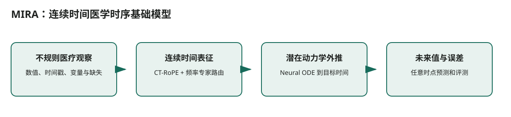

# MIRA：连续时间医学时序基础模型

## 核心信息
- 标题: MIRA: Medical Time Series Foundation Model for Real-World Health Data
- 年份: 2025（当前检索到的 arXiv 版本为 v7）
- 论文链接: https://arxiv.org/abs/2506.07584
- 代码 / 项目: https://github.com/Microsoft/MIRA
- 证据来源: [第二轮调研 S001；全文 p.1–4](../../调研证据/证据/2506.07584.pdf)

## 原文摘要翻译
本文提出 MIRA，一种针对真实医疗时序预测的基础模型。针对不规则采样、不同频率和缺失值，模型组合连续时间旋转位置编码、按频率路由的专家层和基于 Neural ODE 的连续动力学外推。作者称其在大规模公开医疗时序上预训练，并在分布内和分布外预测中优于零样本和微调基线。

## 创新点
如何让一个预测器同时处理不规则观测、不同采样频率和任意目标时间点，而不是把医疗记录强行重采样为规则网格？

## 一句话总结
如何让一个预测器同时处理不规则观测、不同采样频率和任意目标时间点，而不是把医疗记录强行重采样为规则网格？

## 研究问题
如何让一个预测器同时处理不规则观测、不同采样频率和任意目标时间点，而不是把医疗记录强行重采样为规则网格？

## 数据与任务定义
输入为带时间戳、变量标识和缺失模式的医疗观察；输出为任意未来时间点的数值预测。论文称预训练语料超过 4540 亿时间点，当前版本未给出足以排定双 L40 后训练的明确最小模型显存。

## 方法主线
### 输入输出流

> 图：依据本文实际的数据流和模块关系重绘；箭头表示计算或证据传递，不表示未经验证的临床因果关系。

1. **不规则医疗观察**：数值、时间戳、变量与缺失
2. **连续时间表征**：CT-RoPE + 频率专家路由
3. **潜在动力学外推**：Neural ODE 到目标时间
4. **未来值与误差**：任意时点预测和评测

### 模型与训练机制
CT-RoPE 将真实时间间隔注入位置相位；频率专家把不同采样节律路由到不同参数子路径；Neural ODE 在潜在空间连续推进状态。三者分别处理时间间隔、频率异质性和任意预测时点，不能只概括为“一个 Transformer”。

## 关键结果
作者在摘要报告：相对其他零样本和微调基线，分布外和分布内预测误差平均降低约 8% 和 6%。这些是作者报告的聚合结论，具体任务、切分和最小 checkpoint 需要以官方代码再核验。

## 深度分析
当前下载版本的更新日期晚于初始提交，且模型尺寸、许可证和双 L40 微调峰值内存尚未被本调研充分核实。医学跨域结果也不等于老年流感年龄分层有效。

## 局限
对项目最有价值的是不规则事件的时间编码方式。建议先做最小 checkpoint 的推理和 LoRA 试跑，再比较与 Chronos 的规则窗口预处理；若流感数据本身是周度规则序列，MIRA 的复杂连续时间模块未必带来收益。

## 我的笔记
- 复现时固定数据版本、预测时点、训练/验证/测试的时间边界和随机种子。
- 双 L40 只作为后训练资源条件；记录每张卡的峰值显存、序列长度、精度和可训练参数比例。
- 对医疗结果同时报告性能、校准、覆盖和数据覆盖边界，不能仅用单一分数判断可部署性。

## 引用
[第二轮调研 S001；全文 p.1–4](../../调研证据/证据/2506.07584.pdf)
