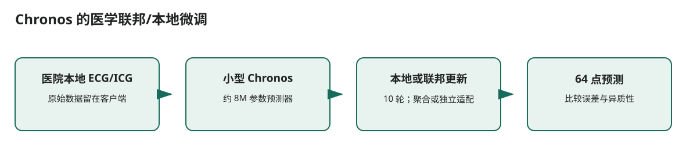

# Chronos 的医学联邦/本地微调

## 核心信息
- 标题: Fine-Tuning Foundation Models with Federated Learning for Privacy Preserving Medical Time Series Forecasting
- 年份: 2025
- 论文链接: https://arxiv.org/abs/2502.09744
- 代码 / 项目: https://github.com/amazon-science/chronos-forecasting
- 证据来源: [第二轮调研 S004；全文 p.4–7](../../调研证据/证据/2502.09744.pdf)

## 原文摘要翻译
本文研究在 ECG 和阻抗心动图数据上使用联邦学习微调时序基础模型。结果表明，联邦微调是否优于本地微调取决于客户端数据分布；在非独立同分布场景中，本地微调可能更好。

## 创新点
医疗机构不能共享原始时序数据时，协同微调小型时序基础模型是否比各机构独立微调更有效？

## 一句话总结
医疗机构不能共享原始时序数据时，协同微调小型时序基础模型是否比各机构独立微调更有效？

## 研究问题
医疗机构不能共享原始时序数据时，协同微调小型时序基础模型是否比各机构独立微调更有效？

## 数据与任务定义
作者选用约 8M 参数的 Chronos，并在 ECG、ICG 预测任务上比较零样本、本地微调与 FedAvg、FedProx、Fed-LA。每个客户端的切分方式和异质性是实验自变量。

## 方法主线
### 输入输出流

> 图：依据本文实际的数据流和模块关系重绘；箭头表示计算或证据传递，不表示未经验证的临床因果关系。

1. **医院本地 ECG/ICG**：原始数据留在客户端
2. **小型 Chronos**：约 8M 参数预测器
3. **本地或联邦更新**：10 轮；聚合或独立适配
4. **64 点预测**：比较误差与异质性

### 模型与训练机制
联邦方案向客户端下发当前全局权重，客户端在本地更新再上传参数变化，服务器聚合。该论文不是 LoRA 论文，也没有给出双 L40 峰值内存；其价值是证明小模型医学微调与数据异质性之间的关系。

## 关键结果
在一些设置中联邦学习优于零样本和本地基线；非独立同分布条件下，本地微调优于联邦微调。论文因此明确否定“联邦必然改善基础模型微调”的假设。

## 深度分析
只有 ECG/ICG，未验证流感；FL 通信、隐私攻击面和训练资源没有完整量化。结果受客户端划分规则影响。

## 局限
这是双 L40 首个实验的直接模板：先选择 Chronos 小版本，分别跑本地微调与按医院/地区模拟的异质切分。老年流感的地区差异可用相同对照，但必须保持每个预测时点的数据可见性。

## 我的笔记
- 复现时固定数据版本、预测时点、训练/验证/测试的时间边界和随机种子。
- 双 L40 只作为后训练资源条件；记录每张卡的峰值显存、序列长度、精度和可训练参数比例。
- 对医疗结果同时报告性能、校准、覆盖和数据覆盖边界，不能仅用单一分数判断可部署性。

## 引用
[第二轮调研 S004；全文 p.4–7](../../调研证据/证据/2502.09744.pdf)
