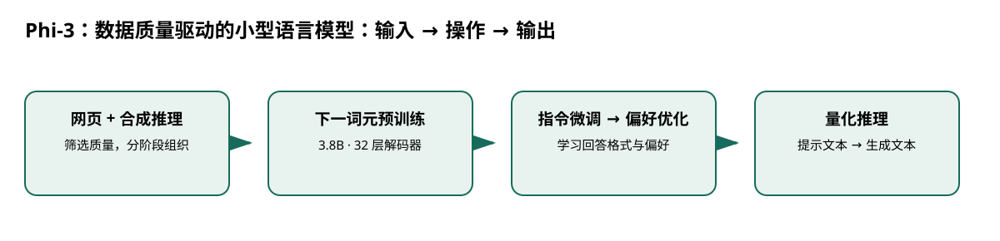

# Phi-3：数据质量驱动的小型语言模型

> 身份与版本：依据修正后的本地 PDF（arXiv 2404.14219v4）。原报告中若将主题替代论文写成同名原论文，已在本笔记和身份核对文件中明确标注。

## 核心信息
- 标题: Phi-3 Technical Report: A Highly Capable Language Model Locally on Your Phone
- 标题翻译: Phi-3：数据质量驱动的小型语言模型
- 作者: Marah Abdin, Jyoti Aneja, Hany Awadalla, Ahmed Awadallah, Ammar Ahmad Awan, Nguyen Bach, Amit Bahree, Arash Bakhtiari 等
- 发表时间: 2024-04-22
- 发表渠道: arXiv / 论文版本见本地 PDF
- DOI: 未提供
- arXiv: [2404.14219v4](https://arxiv.org/abs/2404.14219v4)
- 论文链接: https://arxiv.org/abs/2404.14219v4
- 代码 / 项目: [https://github.com/microsoft/Phi-3CookBook](https://github.com/microsoft/Phi-3CookBook)
- 数据 / 资源: 见“数据与任务定义”
- 论文类型: AI 方法

## 原文摘要翻译
我们介绍 Phi-3-mini：一个在 3.3 万亿词元上训练的 38 亿参数语言模型。学术基准和内部测试显示，其总体表现可与 Mixtral 8×7B、GPT-3.5 等模型竞争，例如在 MMLU 上约为 69%，在 MT-Bench 上为 8.38，同时小到可以部署在手机上。训练数据是 Phi-2 所用数据的扩展版，由严格过滤的公开网页和合成数据组成。模型还经过对齐，以改善稳健性、安全性和对话格式。我们也提供在 4.8 万亿词元上训练的 70 亿、140 亿参数模型 Phi-3-small 和 Phi-3-medium 的扩展结果；二者能力显著更强，MMLU 分别约为 75%、78%，MT-Bench 分别为 8.7、8.9。为增强多语言、多模态和长上下文能力，我们进一步引入 Phi-3.5-mini、Phi-3.5-MoE 与 Phi-3.5-Vision。Phi-3.5-MoE 包含 16 个 38 亿参数专家，激活参数为 66 亿；其语言推理、数学和代码表现优于同量级的 Llama 3.1、Mixtral 系列，并与 Gemini-1.5-Flash、GPT-4o-mini 相当。由 Phi-3.5-mini 派生的 42 亿参数视觉模型则擅长单图或多图与文本联合输入的推理。

## 创新点
- **方法或组织贡献**：参数受限时，能否用严格筛选的网页、合成推理数据和后训练，替代一部分模型规模带来的能力？本文的部署目标是本地语言助手，不是数值预测器。
- **可复用部分**：### 模型与目标
预训练损失为 $-\sum_t\log p_	heta(w_t\mid w_{<t})$。
- **边界提醒**：论文的结论只适用于下文的数据、任务和评估协议。

## 一句话总结
参数受限时，能否用严格筛选的网页、合成推理数据和后训练，替代一部分模型规模带来的能力？本文的部署目标是本地语言助手，不是数值预测器。

## 研究问题
参数受限时，能否用严格筛选的网页、合成推理数据和后训练，替代一部分模型规模带来的能力？本文的部署目标是本地语言助手，不是数值预测器。

## 数据与任务定义
输入为文本词元，输出为自回归文本。本文笔记主要讨论最初的 Phi-3-mini；当前 PDF 的 v4 摘要还包含后续 Phi-3.5，不能混合比较。

| 项目 | 原文设置 |
|---|---|
| 主模型 | 3.8B 参数；32 层、32 个注意力头、隐藏维 3072 |
| 预训练 | 3.3T 词元，过滤网页与合成数据；两阶段训练 |
| 上下文 | 默认 4K；另有使用 LongRoPE 的 128K 版本 |
| 后训练 | 监督指令微调，再直接偏好优化 |
| 部署演示 | 4 位量化约 1.8GB；iPhone 14 离线超过 12 词元/秒 |

设置见 PDF p.2–5。手机结果是量化推理演示，不是训练显存需求。完整数据配方与预训练资源不足以独立重建。

## 方法主线
### 机制流程

> 图：本文依据原文输入—机制—输出关系重绘；用于解释流程，不替代原论文结果图。

图中四个框分别对应原文的输入、变换/学习、输出和评估；箭头表达数据或证据的实际流向，不代表额外的因果保证。

1. **输入公开网页和合成材料**：输入公开网页和合成材料，筛选知识密度与推理内容，形成两阶段预训练语料。
2. **输入词元序列**：输入词元序列，用解码器的下一词元预测目标训练 3.8B 基座，得到通用语言参数。
3. **输入指令示范和偏好对**：输入指令示范和偏好对，依次进行监督微调与偏好优化，输出对话模型。
4. **输入用户提示**：输入用户提示，模型自回归生成文本；量化是部署环节，不能替代训练。

### 模型、公式与关键实现
### 模型与目标
预训练损失为 $-\sum_t\log p_	heta(w_t\mid w_{<t})$。高质量数据改变了每单位参数学习到的内容，而不是改变语言模型的输出空间。长上下文版本使用位置扩展技术；本报告中的 7B 模型还采用其他注意力设计，不宜直接套到 mini。

### 创新及其证据
关键贡献是把数据筛选、合成与小模型能力联系起来，并提供手机端推理实例。公开基准支持能力结果，但没有完全独立控制数据质量、数据量、架构和后训练的所有因素。

## 关键结果
| 模型 | MMLU | MedQA | MT-Bench |
|---|---:|---:|---:|
| Phi-3-mini | 68.8 | 53.8 | 8.38 |
| GPT-3.5 | 71.4 | 63.4 | 8.35 |

来源：PDF p.6 的作者评测。医学问答仍明显落后于表中 GPT-3.5；小模型整体接近不等于所有领域相当。

## 深度分析
适合作为资源有限的文本解释层候选。3.8B 的参数规模与可量化部署降低推理成本，但知识容量仍有限，事实检索不一定能靠增加推理示例弥补。将监测数字转成文本后让它预测，另有数值编码、输出解析和概率校准问题，本文未验证这些环节。

### 与老年人流感预测的关系
先验证结构化输出和中文医学解释的错误率，再决定是否作为辅助模块；核心预测仍与数值模型比较。复现问题：固定 4K 或 128K 哪个权重？量化前后医学术语与数字转录是否退化？

## 局限
训练集不完全公开，基准去污染和内部测试难以完整复核。英文通用能力、手机推理速度和医学问答成绩都不能推导出中国老年人流感预测性能。不得把 Phi-3.5 的多模态、专家模型结果记到 Phi-3-mini 名下。

## 我的笔记
- 先固定论文版本、数据发布日期、患者/地区时间切分和随机种子，再比较模型。
- 所有迁移实验同时报告总体与 65+、75+ 分层；预测模型报告 MAE/WIS、覆盖率、峰值误差和提前量。
- 医疗强化学习论文中的动作策略、代理奖励和 OPE 不能替代流感数值预测的概率损失；如引入决策，另建 CMDP 与安全评估。

## 引用
- 原始论文：[Phi-3 Technical Report: A Highly Capable Language Model Locally on Your Phone](https://arxiv.org/abs/2404.14219v4)，arXiv:2404.14219v4。
- 本地逐页证据：`../检索记录/01_pages.txt`；关键页码：2, 3, 4, 5, 6。
