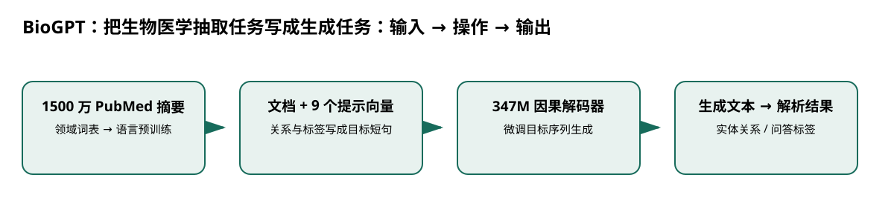

# BioGPT：把生物医学抽取任务写成生成任务

> 身份与版本：依据修正后的本地 PDF（arXiv 2210.10341v3）。原报告中若将主题替代论文写成同名原论文，已在本笔记和身份核对文件中明确标注。

## 核心信息
- 标题: BioGPT: Generative Pre-trained Transformer for Biomedical Text Generation and Mining
- 标题翻译: BioGPT：把生物医学抽取任务写成生成任务
- 作者: Renqian Luo, Liai Sun, Yingce Xia, Tao Qin, Sheng Zhang, Hoifung Poon, Tie-Yan Liu
- 发表时间: 2022-10-19
- 发表渠道: Briefings in Bioinformatics, 2022;, bbac409
- DOI: 10.1093/bib/bbac409
- arXiv: [2210.10341v3](https://arxiv.org/abs/2210.10341v3)
- 论文链接: https://arxiv.org/abs/2210.10341v3
- 代码 / 项目: [https://github.com/microsoft/BioGPT](https://github.com/microsoft/BioGPT)
- 数据 / 资源: 见“数据与任务定义”
- 论文类型: AI 方法

## 原文摘要翻译
受到通用自然语言领域成功的启发，预训练语言模型在生物医学中受到越来越多关注。通用预训练模型主要有 BERT 和 GPT 两个分支；其中前者及其变体已经在生物医学中得到广泛研究，如 BioBERT 与 PubMedBERT。它们在多种判别式任务上取得成功，但缺乏生成能力限制了应用范围。本文提出 BioGPT，一个在大规模生物医学文献上预训练的领域生成式 Transformer。我们在六类生物医学自然语言任务上评估，发现其在多数任务上超过既有模型。尤其是在 BC5CDR、KD-DTI、DDI 端到端关系抽取任务上分别取得 44.98%、38.42%、40.76% 的 F1，在 PubMedQA 上取得 78.2% 的准确率，刷新了当时记录。生成案例还显示模型能够流畅描述生物医学术语。代码已公开。

## 创新点
- **方法或组织贡献**：领域 BERT 擅长分类和表示，但难以直接生成开放形式答案。BioGPT 尝试用一个生成接口统一关系抽取、问答和文档分类。
- **可复用部分**：### 可学习提示与目标序列
实验常用 9 个连续提示向量。
- **边界提醒**：论文的结论只适用于下文的数据、任务和评估协议。

## 一句话总结
领域 BERT 擅长分类和表示，但难以直接生成开放形式答案。BioGPT 尝试用一个生成接口统一关系抽取、问答和文档分类。

## 研究问题
领域 BERT 擅长分类和表示，但难以直接生成开放形式答案。BioGPT 尝试用一个生成接口统一关系抽取、问答和文档分类。

## 数据与任务定义
| 项目 | 设置 |
|---|---|
| 预训练语料 | 约 1500 万条 PubMed 标题与摘要 |
| 基座 | 347M 参数，24 层、隐藏维 1024、16 头；词表 42384 |
| 预训练 | 8 张 V100，200K 步；峰值学习率 2e-4，预热 20K 步 |
| 预训练批量 | 每卡 1024 词元，8 卡并行、64 次梯度累积 |
| BC5CDR | 训练/验证/测试各 500 文档；100 轮，学习率 1e-5 |
| PubMedQA | 标注集 450/50/500；还使用辅助数据与两阶段微调 |

p.3–6。原报告中的 1.5B 不能替代本文主实验 347M 的参数量。

## 方法主线
### 机制流程

> 图：本文依据原文输入—机制—输出关系重绘；用于解释流程，不替代原论文结果图。

图中四个框分别对应原文的输入、变换/学习、输出和评估；箭头表达数据或证据的实际流向，不代表额外的因果保证。

1. **输入 PubMed 标题和摘要**：输入 PubMed 标题和摘要，用领域词表编码，再训练因果解码器的语言建模能力。
2. **输入下游文档**：输入下游文档，将关系或标签改写成自然语言目标序列，并在来源与目标之间加入可学习提示向量。
3. **在下游数据上微调模型和提示**：在下游数据上微调模型和提示，以目标序列的生成监督学习抽取或分类。
4. **推理时生成目标文本**：推理时生成目标文本，再解析实体关系或类别，计算任务指标。

### 模型、公式与关键实现
### 可学习提示与目标序列
实验常用 9 个连续提示向量。关系抽取把三元组转换为描述关系的短句，模型必须同时生成实体和关系，避免依赖一个完全正确的外部实体识别器。这里使用连续提示并不意味着只训练提示参数。

### 复现关键
BC5CDR 使用最后 5 个检查点平均；加入验证集训练的结果另行标记。PubMedQA 的 78.2% 包含额外训练数据和两阶段微调，不能与只用 450 条标注数据的方案当作完全同预算比较。

## 关键结果
| 任务 / 指标 | GPT-2 对照 | BioGPT |
|---|---:|---:|
| BC5CDR 微平均 F1 | 37.39 | 44.98 |
| KD-DTI F1 | 28.45 | 38.42 |
| DDI F1 | 24.68 | 40.76 |

p.5–6；PubMedQA 准确率为 78.2%。BC5CDR 加入验证集训练后为 46.17%，应与仅训练集的 44.98% 分开。DDI 上相对 REBEL 的额外预训练版本仅高 0.20 个百分点，优势并非处处很大。

## 深度分析
领域语料让术语及关系表达更符合任务，生成接口降低为每个任务设计头部的成本。代价是解析敏感：同义表达、遗漏实体或额外文本都可能影响精确匹配。流畅生成说明语言形式学得较好，不能证明所有事实正确。

### 与老年人流感预测的关系
更适合用作医学文本结构化对照。若提取流感风险因子，固定实体规范化与解析规则，并对比编码器分类方法；不应将关系抽取 F1 当成流感预测收益。

## 局限
PubMed 摘要不等于临床病历；预训练和下游语料接近还需检查重复。本文没有时间序列建模、流感发病率预测或年龄分层验证。

## 我的笔记
- 先固定论文版本、数据发布日期、患者/地区时间切分和随机种子，再比较模型。
- 所有迁移实验同时报告总体与 65+、75+ 分层；预测模型报告 MAE/WIS、覆盖率、峰值误差和提前量。
- 医疗强化学习论文中的动作策略、代理奖励和 OPE 不能替代流感数值预测的概率损失；如引入决策，另建 CMDP 与安全评估。

## 引用
- 原始论文：[BioGPT: Generative Pre-trained Transformer for Biomedical Text Generation and Mining](https://arxiv.org/abs/2210.10341v3)，arXiv:2210.10341v3。
- 本地逐页证据：`../检索记录/04_pages.txt`；关键页码：3, 4, 5, 6, 7。
