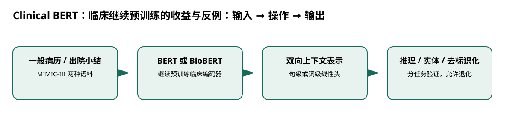

# Clinical BERT：临床继续预训练的收益与反例

> 身份与版本：依据修正后的本地 PDF（arXiv 1904.03323v3）。原报告中若将主题替代论文写成同名原论文，已在本笔记和身份核对文件中明确标注。

## 核心信息
- 标题: Publicly Available Clinical BERT Embeddings
- 标题翻译: Clinical BERT：临床继续预训练的收益与反例
- 作者: Emily Alsentzer, John R. Murphy, Willie Boag, Wei-Hung Weng, Di Jin, Tristan Naumann, Matthew B. A. McDermott
- 发表时间: 2019-04-06
- 发表渠道: arXiv / 论文版本见本地 PDF
- DOI: 未提供
- arXiv: [1904.03323v3](https://arxiv.org/abs/1904.03323v3)
- 论文链接: https://arxiv.org/abs/1904.03323v3
- 代码 / 项目: [https://github.com/EmilyAlsentzer/clinicalBERT](https://github.com/EmilyAlsentzer/clinicalBERT)
- 数据 / 资源: 见“数据与任务定义”
- 论文类型: AI 方法

## 原文摘要翻译
ELMo、BERT 等上下文词嵌入模型近期显著改善了多种自然语言处理任务，但在临床文本等专业语料上的探索较少，临床领域当时也没有公开的预训练 BERT。本文为此研究并发布两个临床文本模型，一个用于一般临床文本，另一个专门针对出院小结。相比非领域嵌入，领域模型在三项常见临床自然语言任务上带来改善。但在两项临床去标识化任务上，领域模型不如通用模型；作者认为这是去标识化预训练文本与经过合成、含身份信息的下游任务文本之间存在差异的自然结果。

## 创新点
- **方法或组织贡献**：通用或生物医学文献预训练能否进一步适配医院笔记？关键不只是“医学词汇更多”，而是预训练文本格式是否与下游任务一致。
- **可复用部分**：### 编码器定位
双向注意力利用句内前后文，输出上下文表示；它不自回归生成回答。
- **边界提醒**：论文的结论只适用于下文的数据、任务和评估协议。

## 一句话总结
通用或生物医学文献预训练能否进一步适配医院笔记？关键不只是“医学词汇更多”，而是预训练文本格式是否与下游任务一致。

## 研究问题
通用或生物医学文献预训练能否进一步适配医院笔记？关键不只是“医学词汇更多”，而是预训练文本格式是否与下游任务一致。

## 数据与任务定义
论文为 Alsentzer 等人的公开临床嵌入工作，匹配 Bio_ClinicalBERT 权重；不是另一篇同名 ClinicalBERT 住院再入院预测论文。

| 设置 | 内容 |
|---|---|
| 语料 | MIMIC-III 约 200 万条临床笔记；另设出院小结子集 |
| 初始化 | BERT-Base 或 BioBERT |
| 适配 | 临床语料继续预训练，再接线性任务头 |
| 任务 | MedNLI 推理、临床实体标注、去标识化 |
| 资源 | 单张 12GB Titan X；原文报告约 17–18 天预训练过程 |

p.2–4。MIMIC 需要完成数据使用授权；权重可下载并不使原始病历公开。

## 方法主线
### 机制流程

> 图：本文依据原文输入—机制—输出关系重绘；用于解释流程，不替代原论文结果图。

图中四个框分别对应原文的输入、变换/学习、输出和评估；箭头表达数据或证据的实际流向，不代表额外的因果保证。

1. **输入 MIMIC 临床笔记**：输入 MIMIC 临床笔记，按一般笔记或出院小结组织语料，形成两个领域版本。
2. **从 BERT 或 BioBERT 参数初始化**：从 BERT 或 BioBERT 参数初始化，继续进行双向语言表示预训练，得到临床编码器。
3. **输入句对或词序列**：输入句对或词序列，用编码器输出接线性预测头，分别训练推理分类或实体标注。
4. **在相应临床任务测试集上评估准确率或精确匹配 F1**：在相应临床任务测试集上评估准确率或精确匹配 F1，并观察去标识化的退化。

### 模型、公式与关键实现
### 编码器定位
双向注意力利用句内前后文，输出上下文表示；它不自回归生成回答。对句对任务利用整体表示分类，对序列标注为每个词预测标签。将它当作可直接输出未来数值的预测器，缺少时间聚合和预测头两个环节。

### 为什么去标识化反而退化
预训练病历中的真实姓名等被占位符替换；任务文本则用合成身份内容。模型因此学会的分布未必包含下游要识别的实体形态，领域更近并不必然更好。

## 关键结果
| 初始化与适配 | MedNLI 准确率 | i2b2 2010 F1 | i2b2 2014 F1 |
|---|---:|---:|---:|
| BERT | 77.6 | 83.5 | 92.8 |
| BioBERT | 80.8 | 86.5 | 93.0 |
| Bio + Clinical | 82.7 | 87.2 | 92.5 |
| Bio + Discharge | 82.7 | 87.8 | 92.7 |

p.4 表2。收益集中在推理和部分实体任务；2014 去标识化恰好反向。

## 深度分析
这篇提供了较清楚的初始化和语料适配比较。BioBERT 先学文献术语，再学医院笔记，能减少语域差异；但去标识化反例说明预处理会改变标签相关信号。选择领域模型应依据具体任务，而非模型名字。

### 与老年人流感预测的关系
若项目加入病历文本，可先冻结编码器得到特征，再与纯监测时序基线比较。划分应按患者和时间进行；用未来出院小结预测之前风险会泄漏未来信息。

## 局限
单医院 ICU 语料限制外推。作者承认继续预训练包含少量下游数据所来自的笔记，认为影响很小；这不是严格排除数据污染的证据。美国英文病历结果不能直接迁移到中文门诊监测。

## 我的笔记
- 先固定论文版本、数据发布日期、患者/地区时间切分和随机种子，再比较模型。
- 所有迁移实验同时报告总体与 65+、75+ 分层；预测模型报告 MAE/WIS、覆盖率、峰值误差和提前量。
- 医疗强化学习论文中的动作策略、代理奖励和 OPE 不能替代流感数值预测的概率损失；如引入决策，另建 CMDP 与安全评估。

## 引用
- 原始论文：[Publicly Available Clinical BERT Embeddings](https://arxiv.org/abs/1904.03323v3)，arXiv:1904.03323v3。
- 本地逐页证据：`../检索记录/05_pages.txt`；关键页码：2, 3, 4, 7。
