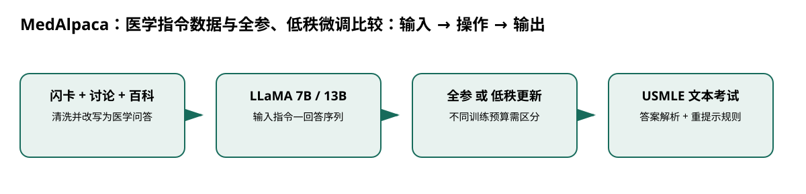

# MedAlpaca：医学指令数据与全参、低秩微调比较

> 身份与版本：依据修正后的本地 PDF（arXiv 2304.08247v3）。原报告中若将主题替代论文写成同名原论文，已在本笔记和身份核对文件中明确标注。

## 核心信息
- 标题: MedAlpaca -- An Open-Source Collection of Medical Conversational AI Models and Training Data
- 标题翻译: MedAlpaca：医学指令数据与全参、低秩微调比较
- 作者: Tianyu Han, Lisa C. Adams, Jens-Michalis Papaioannou, Paul Grundmann, Tom Oberhauser, Alexei Figueroa, Alexander Löser, Daniel Truhn 等
- 发表时间: 2023-04-14
- 发表渠道: arXiv / 论文版本见本地 PDF
- DOI: 未提供
- arXiv: [2304.08247v3](https://arxiv.org/abs/2304.08247v3)
- 论文链接: https://arxiv.org/abs/2304.08247v3
- 代码 / 项目: [https://github.com/kbressem/medAlpaca](https://github.com/kbressem/medAlpaca)
- 数据 / 资源: 见“数据与任务定义”
- 论文类型: AI 方法

## 原文摘要翻译
随着 GPT 等大语言模型不断进步，人工智能应用进入更多领域。在医学中，这类模型有望改善工作流程、诊断、患者照护与教育，但迫切需要可以本地部署的开源模型以保护隐私。我们提出一个超过 16 万条记录的数据集，专门用于医疗应用的大语言模型微调。我们研究这些数据对公开预训练语言模型的微调效果，并在医生取得执业资格所需的考试任务上，对比仅预训练模型和经过微调的模型。

## 创新点
- **方法或组织贡献**：能否用可整理、可公开的医学问答数据，把通用 LLaMA 变成可本地部署的医学对话模型？同时，低成本低秩适配是否能复制全参效果？
- **可复用部分**：### 训练目标与对照
监督损失仍为回答词元的负对数似然。
- **边界提醒**：论文的结论只适用于下文的数据、任务和评估协议。

## 一句话总结
能否用可整理、可公开的医学问答数据，把通用 LLaMA 变成可本地部署的医学对话模型？同时，低成本低秩适配是否能复制全参效果？

## 研究问题
能否用可整理、可公开的医学问答数据，把通用 LLaMA 变成可本地部署的医学对话模型？同时，低成本低秩适配是否能复制全参效果？

## 数据与任务定义
| 项目 | 实验设置 |
|---|---|
| 数据 | 闪卡 33955；StackExchange 52475；WikiDoc 67704；患者信息 5942 |
| 模型 | LLaMA 7B、13B |
| 全参微调 | 5 轮，有效批量 256；7B 学习率 2e-5，13B 为 1e-5；余弦调度 |
| 低秩 / 8 位方案 | 3 轮，学习率 2e-5 |
| 测试 | 去掉含图题的 USMLE Step 1/2/3，各 119/120/135 题 |

p.3–5。部分资料通过 GPT-3.5 改写为问答；评测对不符合格式的回答最多重提示 5 次，复现要保留该规则。

## 方法主线
### 机制流程

> 图：本文依据原文输入—机制—输出关系重绘；用于解释流程，不替代原论文结果图。

图中四个框分别对应原文的输入、变换/学习、输出和评估；箭头表达数据或证据的实际流向，不代表额外的因果保证。

1. **输入医学闪卡、讨论和百科资料**：输入医学闪卡、讨论和百科资料，清洗并改写成指令—回答样本，汇入 Medical Meadow。
2. **将指令和回答分词**：将指令和回答分词，载入 LLaMA 7B 或 13B，形成监督训练序列。
3. **分别进行全参更新或低秩适配**：分别进行全参更新或低秩适配，学习医学回答的条件似然，输出多种模型。
4. **输入未含图片的考试题**：输入未含图片的考试题，按固定答案抽取与重提示规则得到准确率。

### 模型、公式与关键实现
### 训练目标与对照
监督损失仍为回答词元的负对数似然。全参微调更新骨干权重；低秩方案将权重增量限制为低秩乘积。两者不仅可训练参数不同，训练轮数也不同，因此实验不是严格隔离“低秩约束”的比较。

### 数据比模型接口更重要
Medical Meadow 把来源异质的材料统一成对话监督，但统一格式无法保证事实一致；错误来源和教师改写会传递到学生模型。

## 关键结果
| 模型 | Step 1 | Step 2 | Step 3 |
|---|---:|---:|---:|
| LLaMA 7B | 0.198 | 0.202 | 0.203 |
| MedAlpaca 7B 全参 | 0.297 | 0.312 | 0.398 |
| MedAlpaca 7B 低秩 | 0.231 | 0.202 | 0.179 |
| MedAlpaca 13B 全参 | 0.473 | 0.477 | 0.602 |
| MedAlpaca 13B 低秩 | 0.250 | 0.255 | 0.255 |

p.5。全参结果优于本次低秩配置，但论文未充分调参，不能得出低秩微调普遍无效。

## 深度分析
数据构建和本地部署路径是实用贡献。小规模考试能验证知识问答改善，但数百题产生的波动、题目来源重叠和格式处理都会影响排名。模型规模和训练方式的差异应分别消融。

### 与老年人流感预测的关系
可以借用指令数据组织方法训练解释层，但不要把医学选择题与时间序列拼成同一个未经定义的奖励。低秩基线应匹配训练步数、验证策略和可用算力后再判断。

## 局限
缺少临床真实结局评估；生成式教师可能带来幻觉与许可证边界。考试是静态知识任务，不能证明随季节变化的流感风险预测能力，也没有验证年龄公平性。

## 我的笔记
- 先固定论文版本、数据发布日期、患者/地区时间切分和随机种子，再比较模型。
- 所有迁移实验同时报告总体与 65+、75+ 分层；预测模型报告 MAE/WIS、覆盖率、峰值误差和提前量。
- 医疗强化学习论文中的动作策略、代理奖励和 OPE 不能替代流感数值预测的概率损失；如引入决策，另建 CMDP 与安全评估。

## 引用
- 原始论文：[MedAlpaca -- An Open-Source Collection of Medical Conversational AI Models and Training Data](https://arxiv.org/abs/2304.08247v3)，arXiv:2304.08247v3。
- 本地逐页证据：`../检索记录/06_pages.txt`；关键页码：2, 3, 4, 5。
