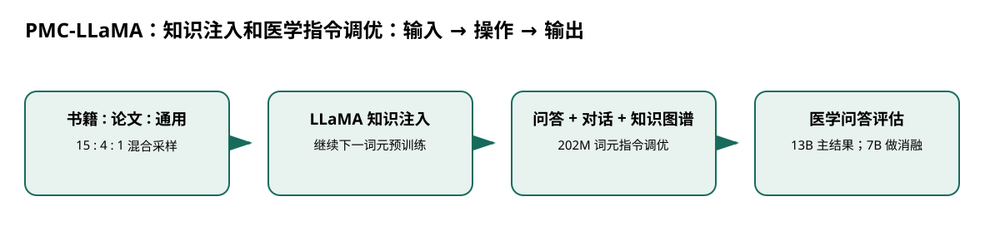

# PMC-LLaMA：知识注入和医学指令调优

> 身份与版本：依据修正后的本地 PDF（arXiv 2304.14454v3）。原报告中若将主题替代论文写成同名原论文，已在本笔记和身份核对文件中明确标注。

## 核心信息
- 标题: PMC-LLaMA: Towards Building Open-source Language Models for Medicine
- 标题翻译: PMC-LLaMA：知识注入和医学指令调优
- 作者: Chaoyi Wu, Weixiong Lin, Xiaoman Zhang, Ya Zhang, Yanfeng Wang, Weidi Xie
- 发表时间: 2023-04-27
- 发表渠道: arXiv / 论文版本见本地 PDF
- DOI: 未提供
- arXiv: [2304.14454v3](https://arxiv.org/abs/2304.14454v3)
- 论文链接: https://arxiv.org/abs/2304.14454v3
- 代码 / 项目: [https://github.com/chaoyi-wu/PMC-LLaMA](https://github.com/chaoyi-wu/PMC-LLaMA)
- 数据 / 资源: 见“数据与任务定义”
- 论文类型: AI 方法

## 原文摘要翻译
大语言模型在自然语言理解、日常对话和问答中展示了突出能力，但由于缺乏领域知识，在医学等要求精确性的领域仍常遇到困难。本文介绍面向医学的开源语言模型 PMC-LLaMA 的构建流程。贡献包括：系统研究如何将通用基座适配到医学领域，整合 480 万篇生物医学论文与 3 万本医学教材进行知识注入，再进行领域指令对齐；提供涵盖医学问答、推理依据和对话、共 2.02 亿词元的指令数据；通过全面消融验证各组件。在多个公开医学问答基准上，只有 130 亿参数的 PMC-LLaMA 表现突出，甚至超过 ChatGPT。所有模型、代码与数据在项目仓库提供。

## 创新点
- **方法或组织贡献**：直接指令微调是否足以形成医学能力，还是先补充系统知识更有效？论文把领域继续预训练与指令对齐分开，并比较书籍、论文等来源。
- **可复用部分**：### 两阶段为什么不同
知识注入仍学习下一词元，不要求每段文献具有问答格式；指令阶段让知识以用户需要的形式被调用。
- **边界提醒**：论文的结论只适用于下文的数据、任务和评估协议。

## 一句话总结
直接指令微调是否足以形成医学能力，还是先补充系统知识更有效？论文把领域继续预训练与指令对齐分开，并比较书籍、论文等来源。

## 研究问题
直接指令微调是否足以形成医学能力，还是先补充系统知识更有效？论文把领域继续预训练与指令对齐分开，并比较书籍、论文等来源。

## 数据与任务定义
| 阶段 | 设置 |
|---|---|
| 知识来源 | 4.8M 篇论文约 75B 词元；30K 书籍约 4B 词元 |
| 采样比例 | 书籍 : 论文 : 通用语料 = 15 : 4 : 1 |
| 知识注入 | 长度 2048；批量 3200；AdamW 学习率 2e-5；32 张 A100 |
| 轮数口径 | 5 轮按书籍遍历定义，并非全部混合语料遍历 5 次 |
| 指令调优 | 202M 词元；3 轮，批量 256；8 张 A100 |

p.3–5。使用分片数据并行、低精度与梯度检查点；原始训练预算不能外推为双卡数小时。

## 方法主线
### 机制流程

> 图：本文依据原文输入—机制—输出关系重绘；用于解释流程，不替代原论文结果图。

图中四个框分别对应原文的输入、变换/学习、输出和评估；箭头表达数据或证据的实际流向，不代表额外的因果保证。

1. **输入医学论文、教材和通用文本**：输入医学论文、教材和通用文本，按 15:4:1 的书籍优先比例混合，构成知识注入数据。
2. **在 LLaMA 上继续自回归预训练**：在 LLaMA 上继续自回归预训练，输出具医学知识的基座。
3. **输入对话、带推理问答与 UMLS 知识构造的指令**：输入对话、带推理问答与 UMLS 知识构造的指令，监督调优回答行为。
4. **输出医学回答**：输出医学回答，在 MedQA、MedMCQA、PubMedQA 上比较，并分解知识来源贡献。

### 模型、公式与关键实现
### 两阶段为什么不同
知识注入仍学习下一词元，不要求每段文献具有问答格式；指令阶段让知识以用户需要的形式被调用。合成推理和知识图谱改写扩大监督范围，但教师模型的推理文字未必是真实因果解释。

### 需要明确的版本
更新后的论文主结果为 13B；早期 7B 消融用于研究数据来源。不能将两种规模的成绩拼成同一模型的提升。

## 关键结果
| 7B 知识注入消融 | MedQA | MedMCQA | PubMedQA |
|---|---:|---:|---:|
| 对照 | 44.54 | 48.51 | 73.4 |
| 仅论文 | 44.70 | 50.54 | 69.5 |
| 仅书籍 | 45.56 | 51.45 | 74.6 |

p.6。最终 13B 的三项成绩为 56.36、56.04、77.90。仅论文导致 PubMedQA 下降，支持“数据组织比简单堆医学材料更重要”的判断。

## 深度分析
教材知识结构较完整，书籍优先采样可能更适合考试任务；但这也意味着提升有任务匹配成分，不能证明教材在所有医疗场景最优。和 ChatGPT 的比较还受提示、模型版本及数据使用协议影响。

### 与老年人流感预测的关系
在本项目中优先借鉴“领域知识适配与任务输出适配分离”的实验设计。先用轻量继续预训练做小样本消融，比较教材型知识是否改善解释，避免未经证据就扩大到原论文预算。

## 局限
没有验证真实诊疗结局或纵向风险；教师模型合成内容与基准潜在重叠难以完整排除。数据权利、完整下载可得性和公开仓库承诺仍需逐项检查。

## 我的笔记
- 先固定论文版本、数据发布日期、患者/地区时间切分和随机种子，再比较模型。
- 所有迁移实验同时报告总体与 65+、75+ 分层；预测模型报告 MAE/WIS、覆盖率、峰值误差和提前量。
- 医疗强化学习论文中的动作策略、代理奖励和 OPE 不能替代流感数值预测的概率损失；如引入决策，另建 CMDP 与安全评估。

## 引用
- 原始论文：[PMC-LLaMA: Towards Building Open-source Language Models for Medicine](https://arxiv.org/abs/2304.14454v3)，arXiv:2304.14454v3。
- 本地逐页证据：`../检索记录/07_pages.txt`；关键页码：3, 4, 5, 6。
