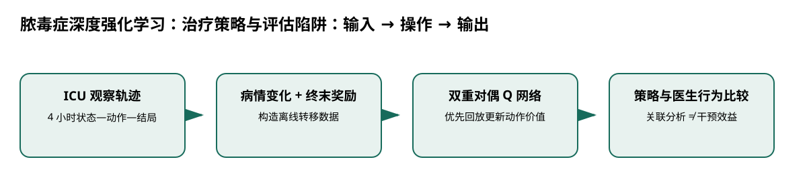

# 脓毒症深度强化学习：治疗策略与评估陷阱

> 身份与版本：依据修正后的本地 PDF（arXiv 1711.09602v1）。原报告中若将主题替代论文写成同名原论文，已在本笔记和身份核对文件中明确标注。

## 核心信息
- 标题: Deep Reinforcement Learning for Sepsis Treatment
- 标题翻译: 脓毒症深度强化学习：治疗策略与评估陷阱
- 作者: Aniruddh Raghu, Matthieu Komorowski, Imran Ahmed, Leo Celi, Peter Szolovits, Marzyeh Ghassemi
- 发表时间: 2017-11-27
- 发表渠道: arXiv / 论文版本见本地 PDF
- DOI: 未提供
- arXiv: [1711.09602v1](https://arxiv.org/abs/1711.09602v1)
- 论文链接: https://arxiv.org/abs/1711.09602v1
- 代码 / 项目: [https://github.com/darkefyre/sepsisrl](https://github.com/darkefyre/sepsisrl)
- 数据 / 资源: 见“数据与任务定义”
- 论文类型: AI 方法

## 原文摘要翻译
脓毒症是重症监护中的主要死亡原因，每年给医院带来数十亿美元成本。治疗十分困难，因为个体对干预反应差异很大，也不存在普遍认可的统一方案。本文提出使用连续状态空间模型与深度强化学习，从数据中推导脓毒症患者的治疗策略。模型学到的策略具有临床可解释性，并在重要方面与医生策略相似。学习到的策略有望辅助重症医生决策，提高患者生存机会。

## 创新点
- **方法或组织贡献**：怎样从离线 ICU 轨迹学习序贯治疗选择，并让医生检查其行为？它替代原清单中未核实的医学预测奖励论文，只能支撑治疗决策的方法背景。
- **可复用部分**：### 核心更新
双重 DQN 使用在线网络选择下一动作，再由目标网络评价：$y=r+\gamma Q_{
m target}(s',rg\max_a Q_	heta(s',a))$。
- **边界提醒**：论文的结论只适用于下文的数据、任务和评估协议。

## 一句话总结
怎样从离线 ICU 轨迹学习序贯治疗选择，并让医生检查其行为？它替代原清单中未核实的医学预测奖励论文，只能支撑治疗决策的方法背景。

## 研究问题
怎样从离线 ICU 轨迹学习序贯治疗选择，并让医生检查其行为？它替代原清单中未核实的医学预测奖励论文，只能支撑治疗决策的方法背景。

## 数据与任务定义
输入为 MIMIC-III 观察性轨迹，输出为离散治疗动作的价值排序。

| 要素 | 原文定义 |
|---|---|
| 队列 | 17898 名 Sepsis-3 患者 |
| 时间尺度 | 4 小时聚合 |
| 状态 | 48 维生理及临床特征 |
| 动作 | 液体与升压药各 5 档的 25 种组合 |
| 奖励 | SOFA、乳酸变化的中间反馈与生存终末反馈 |
| 网络 | 双重、对偶 DQN；两层 128 单元；优先经验回放 |

p.2–4。数据需要 MIMIC 授权；论文并没有流感发病率或老年人专用预测实验。

## 方法主线
### 机制流程

> 图：本文依据原文输入—机制—输出关系重绘；用于解释流程，不替代原论文结果图。

图中四个框分别对应原文的输入、变换/学习、输出和评估；箭头表达数据或证据的实际流向，不代表额外的因果保证。

1. **输入回顾性病历**：输入回顾性病历，构造 4 小时状态、观察动作、下一状态和结局，形成固定离线转移集。
2. **从转移中计算病情变化与终末结局奖励**：从转移中计算病情变化与终末结局奖励，作为时序差分更新目标的一部分。
3. **用双重 Q 学习区分动作选择与目标估值**：用双重 Q 学习区分动作选择与目标估值，对偶网络分开表示状态价值和动作优势。
4. **按动作价值形成候选策略**：按动作价值形成候选策略，分析其与医生行为及观察死亡率的关系，并审查稀疏区域。

### 模型、公式与关键实现
### 核心更新
双重 DQN 使用在线网络选择下一动作，再由目标网络评价：$y=r+\gamma Q_{
m target}(s',rg\max_a Q_	heta(s',a))$。对偶网络将状态价值与相对动作优势组合，优先回放增加大误差转移的训练频次。

### 预测和干预的区别
状态可以包含预测性信息，但输出动作会改变未来环境。以死亡为终末奖励并不表示能把同一个奖励直接用于数值预测；两者目标、数据和评估都不同。

## 关键结果
| 观察 | 能支持什么 | 不能支持什么 |
|---|---|---|
| 中等病情下，动作一致性与较低死亡率相关 | 策略值得进一步临床审查 | 按模型治疗会降低死亡率 |
| 高 SOFA、尤其大于 15 的区域稀疏 | 外推会不稳定 | 模型优于医生 |
| 作者讨论离线策略评估不可靠 | 需要独立验证 | 一张死亡率曲线足以部署 |

证据见 p.3–4。本文未提供随机干预比较，不能把关联曲线写成因果效益百分比。

## 深度分析
连续状态网络避免硬聚类损失信息，但 Q 网络仍可能对未覆盖动作外推。患者病情影响医生动作，也影响死亡；当模型和医生不一致时，患者构成可能已经不同。因此动作一致性分组不是随机对照。

### 与老年人流感预测的关系
对流感项目的直接启示是先明确输出是否真的为“决策动作”。如果只是住院人数预测，应先用监督概率评分；只有引入资源配置等真实序贯决策时，才需另外定义策略和离线评估。

## 局限
奖励依赖代理指标、动作离散化和缺失值处理；离线数据覆盖不足及未观测混杂无法由深网络消除。本文只作为方法研究阅读，不形成任何具体治疗建议。

## 我的笔记
- 先固定论文版本、数据发布日期、患者/地区时间切分和随机种子，再比较模型。
- 所有迁移实验同时报告总体与 65+、75+ 分层；预测模型报告 MAE/WIS、覆盖率、峰值误差和提前量。
- 医疗强化学习论文中的动作策略、代理奖励和 OPE 不能替代流感数值预测的概率损失；如引入决策，另建 CMDP 与安全评估。

## 引用
- 原始论文：[Deep Reinforcement Learning for Sepsis Treatment](https://arxiv.org/abs/1711.09602v1)，arXiv:1711.09602v1。
- 本地逐页证据：`../检索记录/12_pages.txt`；关键页码：2, 3, 4。
