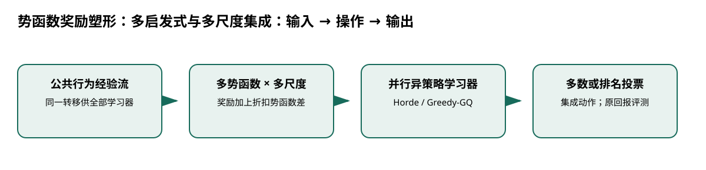

# 势函数奖励塑形：多启发式与多尺度集成

> 身份与版本：依据修正后的本地 PDF（arXiv 1502.03248v2）。原报告中若将主题替代论文写成同名原论文，已在本笔记和身份核对文件中明确标注。

## 核心信息
- 标题: Off-Policy Reward Shaping with Ensembles
- 标题翻译: 势函数奖励塑形：多启发式与多尺度集成
- 作者: Anna Harutyunyan, Tim Brys, Peter Vrancx, Ann Nowe
- 发表时间: 2015-02-11
- 发表渠道: arXiv / 论文版本见本地 PDF
- DOI: 未提供
- arXiv: [1502.03248v2](https://arxiv.org/abs/1502.03248v2)
- 论文链接: https://arxiv.org/abs/1502.03248v2
- 代码 / 项目: 未核实可直接复现本文的官方仓库
- 数据 / 资源: 见“数据与任务定义”
- 论文类型: AI 方法

## 原文摘要翻译
基于势函数的奖励塑形能够利用领域知识加快强化学习，因而被广泛使用。虽然它在理论上保持最优策略不变，学习速度的改善取决于势函数质量，而势函数同时依赖启发式及尺度。事先选择有效启发式和调节尺度都会增加样本复杂度。我们提出一个不增加样本复杂度的塑形框架，以改善学习速度：同时学习针对多个启发式和一系列尺度塑形的策略，再通过投票得到目标策略。集成中的学习器必须能够高效、可靠地进行异策略学习，因此采用 Horde 架构。实验表明，集成策略可超过原始策略和单启发式组件；通用尺度范围的集成至少可达到组件经过最优调参的集成水平。

## 创新点
- **方法或组织贡献**：奖励塑形常需要先知道哪一种启发式和尺度有效，调参又消耗数据。能否让多个塑形学习器共享同一行为轨迹并投票，从而减少额外采样？
- **可复用部分**：### 保持目标的条件
塑形项为 $F(s,a,s')=\gamma\Phi(s')-\Phi(s)$。
- **边界提醒**：论文的结论只适用于下文的数据、任务和评估协议。

## 一句话总结
奖励塑形常需要先知道哪一种启发式和尺度有效，调参又消耗数据。能否让多个塑形学习器共享同一行为轨迹并投票，从而减少额外采样？

## 研究问题
奖励塑形常需要先知道哪一种启发式和尺度有效，调参又消耗数据。能否让多个塑形学习器共享同一行为轨迹并投票，从而减少额外采样？

## 数据与任务定义
| 项目 | 设置 |
|---|---|
| 环境 | Mountain Car、Cart-Pole；非医疗环境 |
| 数据获取 | 固定行为策略产生经验流，多学习器共享 |
| 学习器 | Horde 中的 Greedy-GQ(λ) |
| Mountain Car | 1000 次独立运行，各 100 回合；每 5 回合评估 |
| 示例超参 | 折扣 0.99；迹参数 0.4；主/辅助步长 0.1/0.0001 |
| 尺度集成 | 比较调优范围与 1、10、100、1000、10000 等跨度 |

p.3–6。此处“异策略”不是现代神经离线数据集基准；共享样本不等于不增加计算或内存。

## 方法主线
### 机制流程

> 图：本文依据原文输入—机制—输出关系重绘；用于解释流程，不替代原论文结果图。

图中四个框分别对应原文的输入、变换/学习、输出和评估；箭头表达数据或证据的实际流向，不代表额外的因果保证。

1. **输入固定行为策略的转移流**：输入固定行为策略的转移流，同时为不同启发式定义势函数，复制给多个学习器。
2. **每个学习器将原奖励加上其势函数差**：每个学习器将原奖励加上其势函数差，按不同尺度得到自己的塑形奖励。
3. **各学习器使用 Greedy-GQ 更新目标策略与价值**：各学习器使用 Greedy-GQ 更新目标策略与价值，互不改变公共行为数据。
4. **对候选动作进行多数或排名投票**：对候选动作进行多数或排名投票，输出集成策略并用原任务回报评估。

### 模型、公式与关键实现
### 保持目标的条件
塑形项为 $F(s,a,s')=\gamma\Phi(s')-\Phi(s)$。沿轨迹折扣求和后，中间势函数项消去，只剩边界项；在相应终止与有界条件下，不改变原最优策略。

任意加入“准确率 + 及时性 + 年龄公平”等权重项通常不具备这个结构，会改变优化目标。论文也没有提供这些医学指标的权重。

### 原摘要的措辞
英文摘要出现“reduces learning speed”，与加速动机、正文和实验方向矛盾；以上译文按全文含义解释为改善学习速度，保留此处勘误说明。

## 关键结果
| 对照 | 原文发现 |
|---|---|
| 原始策略与单启发式 | 集成可更快达到较好表现 |
| 两个较弱启发式集成 | Mountain Car 中超过各单体 |
| 加入最强启发式 | 与最佳单体无显著差异，不能称严格等价 |
| 宽尺度与调优尺度集成 | 宽尺度方案可达到相近水平 |

p.5–6；报告的无显著差异不是统计等效检验。

## 深度分析
优势来自共享经验下不同势函数对时序差分信息传播的互补；固定行为策略时不能将收益解释为更好探索。集成降低手选尺度风险，同时把成本转移到多个价值学习器和投票。

### 与老年人流感预测的关系
只在已明确原始决策目标后考虑势函数。若老年人权重是研究者新增的效用设定，应标为新目标并做敏感性分析；不要借本论文宣称权重有临床依据。

## 局限
简单控制环境、线性近似和特定异策略算法的经验结论不保证深度离线医疗学习稳定。不能把策略不变性理论无限外推到函数近似、任意终止处理和有限数据。

## 我的笔记
- 先固定论文版本、数据发布日期、患者/地区时间切分和随机种子，再比较模型。
- 所有迁移实验同时报告总体与 65+、75+ 分层；预测模型报告 MAE/WIS、覆盖率、峰值误差和提前量。
- 医疗强化学习论文中的动作策略、代理奖励和 OPE 不能替代流感数值预测的概率损失；如引入决策，另建 CMDP 与安全评估。

## 引用
- 原始论文：[Off-Policy Reward Shaping with Ensembles](https://arxiv.org/abs/1502.03248v2)，arXiv:1502.03248v2。
- 本地逐页证据：`../检索记录/13_pages.txt`；关键页码：2, 3, 4, 5, 6。
