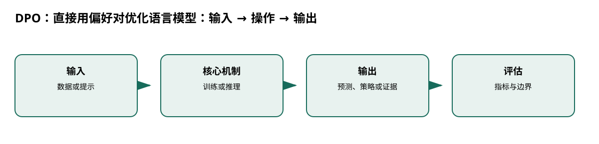

# DPO：直接用偏好对优化语言模型

> 身份与版本：依据修正后的本地 PDF（arXiv 2305.18290v3）。原报告中若将主题替代论文写成同名原论文，已在本笔记和身份核对文件中明确标注。

## 核心信息
- 标题: Direct Preference Optimization: Your Language Model is Secretly a Reward Model
- 标题翻译: DPO：直接用偏好对优化语言模型
- 作者: Rafael Rafailov, Archit Sharma, Eric Mitchell, Stefano Ermon, Christopher D. Manning, Chelsea Finn
- 发表时间: 2023-05-29
- 发表渠道: arXiv / 论文版本见本地 PDF
- DOI: 未提供
- arXiv: [2305.18290v3](https://arxiv.org/abs/2305.18290v3)
- 论文链接: https://arxiv.org/abs/2305.18290v3
- 代码 / 项目: [https://github.com/eric-mitchell/direct-preference-optimization](https://github.com/eric-mitchell/direct-preference-optimization)
- 数据 / 资源: 见“数据与任务定义”
- 论文类型: AI 方法

## 原文摘要翻译
大语言模型知识广泛但难以精确控制。现有 RLHF 先训练奖励模型，再用强化学习并约束偏离参考模型，流程复杂且不稳定。本文重新参数化奖励模型，使对应最优策略具有闭式形式，从而用简单分类损失直接解决标准 RLHF。DPO 无需微调期间从语言模型采样，也少需超参数调节；在情感控制、摘要和单轮对话上达到或超过 PPO-RLHF。

## 创新点
- **方法或组织贡献**：能否把 KL 约束 RLHF 的最优策略写成策略比值，从而去掉独立奖励模型和 PPO 采样？
- **可复用部分**：DPO 的梯度在偏好错误或模型过度自信时可能被放大；β 控制贴近参考策略。
- **边界提醒**：论文的结论只适用于下文的数据、任务和评估协议。

## 一句话总结
能否把 KL 约束 RLHF 的最优策略写成策略比值，从而去掉独立奖励模型和 PPO 采样？

## 研究问题
能否把 KL 约束 RLHF 的最优策略写成策略比值，从而去掉独立奖励模型和 PPO 采样？

## 数据与任务定义
偏好数据为 (x, y胜, y负)，参考策略冻结。实验包括 IMDb 情感、Reddit TL;DR 摘要和 Anthropic HH 对话；对话集约 170K。

## 方法主线
### 机制流程

> 图：本文依据原文输入—机制—输出关系重绘；用于解释流程，不替代原论文结果图。

图中四个框分别对应原文的输入、变换/学习、输出和评估；箭头表达数据或证据的实际流向，不代表额外的因果保证。

1. **输入偏好对和 SFT/参考策略**：输入偏好对和 SFT/参考策略，计算胜负回答的序列对数概率。
2. **用奖励重参数化把 KL 正则最优策略写成 πref exp(r/β)/Z。**：用奖励重参数化把 KL 正则最优策略写成 πref exp(r/β)/Z。
3. **比较策略对数似然比**：比较策略对数似然比，最小化 -logσ(β[(logπθ胜−logπref胜)−(logπθ负−logπref负)])。
4. **用奖励—KL 前沿和 GPT-4/人工偏好胜率评估。**：用奖励—KL 前沿和 GPT-4/人工偏好胜率评估。

### 模型、公式与关键实现
DPO 的梯度在偏好错误或模型过度自信时可能被放大；β 控制贴近参考策略。它仍依赖偏好覆盖和参考模型质量。

## 关键结果
情感控制中 DPO 的奖励—KL 前沿优于 PPO；TL;DR 和 HH 对话胜率达到或超过 PPO（p.7–9）。GPT-4 评价不是医学事实验证。

## 深度分析
DPO 适合离散文本生成；连续点预测模型没有序列概率，不能直接套用损失。偏好数据的胜负只表达相对质量，不提供真实数值目标。

### 与老年人流感预测的关系
[4, 5, 6, 7, 8]

## 局限
若要训练解释文本，可用事实可追溯与不确定性偏好对；流感数值模型仍保留专门概率损失。

## 我的笔记
- 先固定论文版本、数据发布日期、患者/地区时间切分和随机种子，再比较模型。
- 所有迁移实验同时报告总体与 65+、75+ 分层；预测模型报告 MAE/WIS、覆盖率、峰值误差和提前量。
- 医疗强化学习论文中的动作策略、代理奖励和 OPE 不能替代流感数值预测的概率损失；如引入决策，另建 CMDP 与安全评估。

## 引用
- 原始论文：[Direct Preference Optimization: Your Language Model is Secretly a Reward Model](https://arxiv.org/abs/2305.18290v3)，arXiv:2305.18290v3。
- 本地逐页证据：`../检索记录/17_pages.txt`；关键页码：['偏好对 + 参考模型', '胜/负序列概率'], ['奖励闭式重参数化', '消去配分函数'], ['DPO 分类损失', '梯度更新策略'], ['奖励—KL / 胜率', '对比 PPO']。
