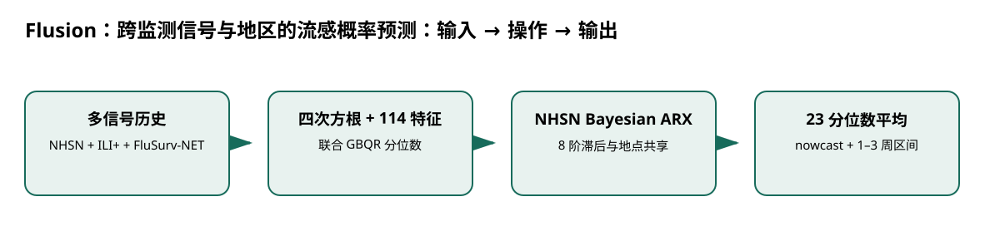

# Flusion：跨监测信号与地区的流感概率预测

> 身份与版本：依据修正后的本地 PDF（arXiv 2407.19054v1）。原报告中若将主题替代论文写成同名原论文，已在本笔记和身份核对文件中明确标注。

## 核心信息
- 标题: Flusion: Integrating multiple data sources for accurate influenza predictions
- 标题翻译: Flusion：跨监测信号与地区的流感概率预测
- 作者: Evan L. Ray, Yijin Wang, Russell D. Wolfinger, Nicholas G. Reich
- 发表时间: 2024-07-26
- 发表渠道: arXiv / 论文版本见本地 PDF
- DOI: 未提供
- arXiv: [2407.19054v1](https://arxiv.org/abs/2407.19054v1)
- 论文链接: https://arxiv.org/abs/2407.19054v1
- 代码 / 项目: [https://github.com/reichlab/flusion](https://github.com/reichlab/flusion)
- 数据 / 资源: 见“数据与任务定义”
- 论文类型: AI 方法

## 原文摘要翻译
美国 CDC 组织流感预测挑战，目标是 NHSN 报告的住院人数，但该信号历史较短。作者用历史更长的 ILI+ 与 FluSurv-NET 辅助信号增强目标数据。Flusion 结合梯度提升分位数回归与贝叶斯自回归模型，各模型在多地点联合训练。2023/24 赛季表现第一；后续分析发现主要收益来自同时使用多信号、多地区训练的 GBQR。

## 创新点
- **方法或组织贡献**：短历史目标监测下，跨地区和跨信号共享是否比只用目标序列更能支持多周概率预测？
- **可复用部分**：分位数回归直接输出概率区间；ARX 提供结构不同的成员。
- **边界提醒**：论文的结论只适用于下文的数据、任务和评估协议。

## 一句话总结
短历史目标监测下，跨地区和跨信号共享是否比只用目标序列更能支持多周概率预测？

## 研究问题
短历史目标监测下，跨地区和跨信号共享是否比只用目标序列更能支持多周概率预测？

## 数据与任务定义
目标为美国 50 州、DC、PR 及全国 NHSN 每周住院；预测 nowcast 和未来 1–3 周，23 个分位数。GBQR 使用 114 维水平、趋势、曲率、日历和地点特征；ARX 只用 NHSN，训练联合多地点。输入只含预测目标自己的历史，非同时期跨州协变量。

## 方法主线
### 机制流程

> 图：本文依据原文输入—机制—输出关系重绘；用于解释流程，不替代原论文结果图。

图中四个框分别对应原文的输入、变换/学习、输出和评估；箭头表达数据或证据的实际流向，不代表额外的因果保证。

1. **输入目标 NHSN 历史及已转换的 ILI+、FluSurv-NET 历史；人口率做四次方根与尺度标准化。**：输入目标 NHSN 历史及已转换的 ILI+、FluSurv-NET 历史；人口率做四次方根与尺度标准化。
2. **GBQR 在所有信号和地点联合训练**：GBQR 在所有信号和地点联合训练，输出 23 个分位数；100 个 70% 季节 bagging 成员取中位数。
3. **Bayesian ARX 以 8 阶滞后和地点共享系数建模目标信号**：Bayesian ARX 以 8 阶滞后和地点共享系数建模目标信号，显式不确定性。
4. **三组分位数预测平均成 Flusion**：三组分位数预测平均成 Flusion，按 MWIS、MAE 和覆盖率回测。

### 模型、公式与关键实现
分位数回归直接输出概率区间；ARX 提供结构不同的成员。消融实际显示 GBQR 单独已经最好，集成本身不是主因；联合地点和信号训练则是关键。

## 关键结果
Flusion 总 MWIS 29.6、rMWIS 0.610、MAE 45.6、rMAE 0.670；FluSight ensemble 分别 35.5、0.731、55.4、0.814。95% 覆盖 Flusion 0.967，但区间整体偏宽。GBQR-only-NHSN rMWIS 0.857，按地点单独训练 0.780，而联合 GBQR 0.625。来源 p.12–17。

## 深度分析
这是 24 篇中与老年人流感预测最直接的基准，但目标是所有年龄的住院人数。其成功来自共享训练样本池，并非实时输入其他地区数据。输入修订、监测口径和数据回填对真实部署影响很大。

### 与老年人流感预测的关系
先复现官方 2023/24 时间切分，再加年龄分层目标；保持分位数损失和滚动回填，报告低发病期、峰值、提前量与 65+ 覆盖率。

## 局限
2023/24 赛季后验分析不等于未来赛季稳定；上尾覆盖较好、下尾区间偏小，且预测区间偏宽。全国目标评估和老年分层性能未单独解决。

## 我的笔记
- 先固定论文版本、数据发布日期、患者/地区时间切分和随机种子，再比较模型。
- 所有迁移实验同时报告总体与 65+、75+ 分层；预测模型报告 MAE/WIS、覆盖率、峰值误差和提前量。
- 医疗强化学习论文中的动作策略、代理奖励和 OPE 不能替代流感数值预测的概率损失；如引入决策，另建 CMDP 与安全评估。

## 引用
- 原始论文：[Flusion: Integrating multiple data sources for accurate influenza predictions](https://arxiv.org/abs/2407.19054v1)，arXiv:2407.19054v1。
- 本地逐页证据：`../检索记录/19_pages.txt`；关键页码：12, 13, 15, 16, 17。
