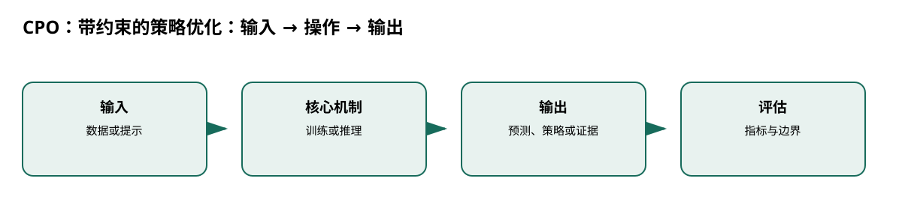

# CPO：带约束的策略优化

> 身份与版本：依据修正后的本地 PDF（arXiv 1705.10528v1）。原报告中若将主题替代论文写成同名原论文，已在本笔记和身份核对文件中明确标注。

## 核心信息
- 标题: Constrained Policy Optimization
- 标题翻译: CPO：带约束的策略优化
- 作者: Joshua Achiam, David Held, Aviv Tamar, Pieter Abbeel
- 发表时间: 2017-05-30
- 发表渠道: arXiv / 论文版本见本地 PDF
- DOI: 未提供
- arXiv: [1705.10528v1](https://arxiv.org/abs/1705.10528v1)
- 论文链接: https://arxiv.org/abs/1705.10528v1
- 代码 / 项目: 未核实可直接复现本文的官方仓库
- 数据 / 资源: 见“数据与任务定义”
- 论文类型: AI 方法

## 原文摘要翻译
许多 RL 应用更适合分别规定回报和约束，而不是把所有行为偏好塞进奖励。CPO 是面向约束 RL 的通用策略搜索算法，提出每次迭代近似满足约束的保证，并在模拟机器人任务上验证。

## 创新点
- **方法或组织贡献**：怎样在训练过程中同时提高回报并控制安全成本，而不是等训练完才检查约束？
- **可复用部分**：CMDP 约束为 $\max_\pi J(\pi)$ s.t. $J_C(\pi)\le d$。
- **边界提醒**：论文的结论只适用于下文的数据、任务和评估协议。

## 一句话总结
怎样在训练过程中同时提高回报并控制安全成本，而不是等训练完才检查约束？

## 研究问题
怎样在训练过程中同时提高回报并控制安全成本，而不是等训练完才检查约束？

## 数据与任务定义
Point、Ant、Humanoid 的 Circle/Gather 模拟任务；状态维 9/32/102，动作维 2/8/10；两层 (64,32) 策略网络，5 或 10 个随机种子（p.6–7）。策略更新依赖在线轨迹，不是离线学习。

## 方法主线
### 机制流程

> 图：本文依据原文输入—机制—输出关系重绘；用于解释流程，不替代原论文结果图。

图中四个框分别对应原文的输入、变换/学习、输出和评估；箭头表达数据或证据的实际流向，不代表额外的因果保证。

1. **输入当前策略采样的状态、动作、回报与成本轨迹。**：输入当前策略采样的状态、动作、回报与成本轨迹。
2. **估计回报优势、约束优势和平均 KL 近似。**：估计回报优势、约束优势和平均 KL 近似。
3. **在 KL 信赖域内解带线性成本约束的二次子问题**：在 KL 信赖域内解带线性成本约束的二次子问题，用共轭梯度和线搜索更新策略。
4. **每次迭代同时画回报和成本；若线性化不可行**：每次迭代同时画回报和成本；若线性化不可行，退回成本下降方向。

### 模型、公式与关键实现
CMDP 约束为 $\max_\pi J(\pi)$ s.t. $J_C(\pi)\le d$。理论是局部近似与散度界，采样估计误差仍可能造成实际违约。

## 关键结果
Circle 与 Gather 任务中 CPO 成本接近约束上限；PDO 有过冲，TRPO 的无约束最优策略会违规（p.7）。

## 深度分析
CPO 的优势是显式成本和训练中约束，而非惩罚系数调参。医疗约束需可观测、可审计且定义准确，模拟安全不等于患者安全。

### 与老年人流感预测的关系
[2, 3, 6, 7]

## 局限
若项目未来做床位或抗病毒资源决策，可借鉴 CMDP 和成本曲线；流感人数预测本身仍是监督预测任务。

## 我的笔记
- 先固定论文版本、数据发布日期、患者/地区时间切分和随机种子，再比较模型。
- 所有迁移实验同时报告总体与 65+、75+ 分层；预测模型报告 MAE/WIS、覆盖率、峰值误差和提前量。
- 医疗强化学习论文中的动作策略、代理奖励和 OPE 不能替代流感数值预测的概率损失；如引入决策，另建 CMDP 与安全评估。

## 引用
- 原始论文：[Constrained Policy Optimization](https://arxiv.org/abs/1705.10528v1)，arXiv:1705.10528v1。
- 本地逐页证据：`../检索记录/21_pages.txt`；关键页码：['状态—动作轨迹', '回报与成本'], ['优势与 KL', '估计更新约束'], ['信赖域二次子问题', '回报上升 + 成本限制'], ['成本曲线', '训练中检查安全']。
