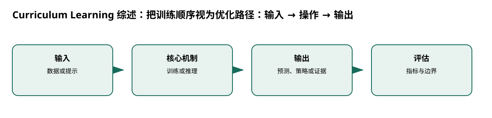

# Curriculum Learning 综述：把训练顺序视为优化路径

> 身份与版本：依据修正后的本地 PDF（arXiv 2101.10382v3）。原报告中若将主题替代论文写成同名原论文，已在本笔记和身份核对文件中明确标注。

## 核心信息
- 标题: Curriculum Learning: A Survey
- 标题翻译: Curriculum Learning 综述：把训练顺序视为优化路径
- 作者: Petru Soviany, Radu Tudor Ionescu, Paolo Rota, Nicu Sebe
- 发表时间: 2021-01-25
- 发表渠道: arXiv / 论文版本见本地 PDF
- DOI: 未提供
- arXiv: [2101.10382v3](https://arxiv.org/abs/2101.10382v3)
- 论文链接: https://arxiv.org/abs/2101.10382v3
- 代码 / 项目: 未核实可直接复现本文的官方仓库
- 数据 / 资源: 见“数据与任务定义”
- 论文类型: 综述

## 原文摘要翻译
课程学习按有意义的顺序、从易到难训练样本，可能在不增加计算成本下优于随机打乱。综述讨论不同任务中的课程策略，手工构建多视角分类，并用凝聚层次聚类形成方法树，最后提出未来方向。

## 创新点
- **方法或组织贡献**：课程不只排序样本，也可逐渐增加模型容量、任务复杂度或改变目标函数；这些形式都可视为让非凸优化从平滑问题逐步过渡。
- **可复用部分**：一般算法为 $p=P(M)$；若调度器触发，则 $(M,E,P)\leftarrow C(l,M,E,P)$，再选 $E^*\subseteq E$ 更新模型。
- **边界提醒**：论文的结论只适用于下文的数据、任务和评估协议。

## 一句话总结
课程不只排序样本，也可逐渐增加模型容量、任务复杂度或改变目标函数；这些形式都可视为让非凸优化从平滑问题逐步过渡。

## 研究问题
课程不只排序样本，也可逐渐增加模型容量、任务复杂度或改变目标函数；这些形式都可视为让非凸优化从平滑问题逐步过渡。

## 数据与任务定义
综述对象为课程学习文献；按数据、模型、任务或目标层级分类，七类包括 vanilla、self-paced、balanced、self-paced balanced、teacher-student、implicit、progressive（p.3–5）。无统一单一数据集或 GPU 要求。

## 方法主线
### 机制流程

> 图：本文依据原文输入—机制—输出关系重绘；用于解释流程，不替代原论文结果图。

图中四个框分别对应原文的输入、变换/学习、输出和评估；箭头表达数据或证据的实际流向，不代表额外的因果保证。

1. **输入训练经验和难度准则。**：输入训练经验和难度准则。
2. **调度器根据迭代或当前性能决定何时改课程。**：调度器根据迭代或当前性能决定何时改课程。
3. **准则修改数据排序、模型容量或性能目标**：准则修改数据排序、模型容量或性能目标，再选择当前子集训练。
4. **用目标任务性能评价课程节奏**：用目标任务性能评价课程节奏，而不是默认“越难越好”。

### 模型、公式与关键实现
一般算法为 $p=P(M)$；若调度器触发，则 $(M,E,P)\leftarrow C(l,M,E,P)$，再选 $E^*\subseteq E$ 更新模型。难度可由句长、噪声、损失或教师网络估计。

## 关键结果
综述结论是课程排序和节奏可改善训练，但难度度量、调度器和数据偏差是主要瓶颈；它不是一个统一数字结果论文。

## 深度分析
对流感序列可按历史长度、缺失率或峰值难度分层，但“容易病例”可能恰好是低流行或偏差样本。必须与随机混合、时间顺序训练和自步学习做同预算比较。

### 与老年人流感预测的关系
[3, 4, 5, 6, 25]

## 局限
只把它作为训练采样设计参考，不声称存在一个普适最优课程。

## 我的笔记
- 先固定论文版本、数据发布日期、患者/地区时间切分和随机种子，再比较模型。
- 所有迁移实验同时报告总体与 65+、75+ 分层；预测模型报告 MAE/WIS、覆盖率、峰值误差和提前量。
- 医疗强化学习论文中的动作策略、代理奖励和 OPE 不能替代流感数值预测的概率损失；如引入决策，另建 CMDP 与安全评估。

## 引用
- 原始论文：[Curriculum Learning: A Survey](https://arxiv.org/abs/2101.10382v3)，arXiv:2101.10382v3。
- 本地逐页证据：`../检索记录/22_pages.txt`；关键页码：['难度准则', '样本 / 模型 / 目标'], ['调度器', '按步数或性能推进'], ['当前子集', '训练更新'], ['最终任务指标', '比较随机训练']。
