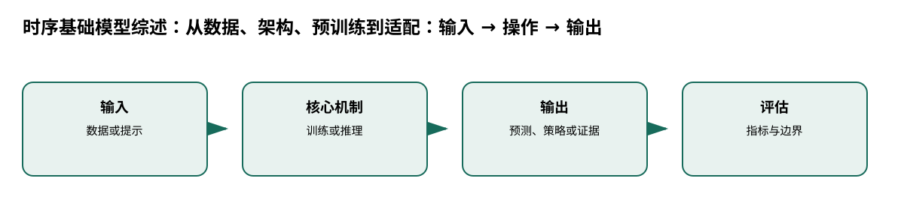

# 时序基础模型综述：从数据、架构、预训练到适配

> 身份与版本：依据修正后的本地 PDF（arXiv 2403.14735v3）。原报告中若将主题替代论文写成同名原论文，已在本笔记和身份核对文件中明确标注。

## 核心信息
- 标题: Foundation Models for Time Series Analysis: A Tutorial and Survey
- 标题翻译: 时序基础模型综述：从数据、架构、预训练到适配
- 作者: Yuxuan Liang, Haomin Wen, Yuqi Nie, Yushan Jiang, Ming Jin, Dongjin Song, Shirui Pan, Qingsong Wen
- 发表时间: 2024-03-21
- 发表渠道: arXiv / 论文版本见本地 PDF
- DOI: 10.1145/3637528.3671451
- arXiv: [2403.14735v3](https://arxiv.org/abs/2403.14735v3)
- 论文链接: https://arxiv.org/abs/2403.14735v3
- 代码 / 项目: 未核实可直接复现本文的官方仓库
- 数据 / 资源: 见“数据与任务定义”
- 论文类型: 综述

## 原文摘要翻译
时间序列分析服务于许多现实应用。基础模型正在改变时序模型设计，预训练或微调模型被用于预测等下游任务。本文从方法论角度综述时序基础模型，按模型架构、预训练技术、适配方式和数据模态分类，补足只按应用或流程归类而缺少机制解释的综述。

## 创新点
- **方法或组织贡献**：要理解“时序基础模型为什么有效”，必须同时看数据模态、骨干结构、预训练目标和迁移方式，而不是只比较一个排行榜。
- **可复用部分**：标准时序 $X\in R^{T	imes D}$；空间时序增加传感器维度；轨迹是带时间的经纬度序列；事件是带时间戳的事件集合。
- **边界提醒**：论文的结论只适用于下文的数据、任务和评估协议。

## 一句话总结
要理解“时序基础模型为什么有效”，必须同时看数据模态、骨干结构、预训练目标和迁移方式，而不是只比较一个排行榜。

## 研究问题
要理解“时序基础模型为什么有效”，必须同时看数据模态、骨干结构、预训练目标和迁移方式，而不是只比较一个排行榜。

## 数据与任务定义
综述覆盖标准时序、空间时序、轨迹和事件；架构分 Transformer、非 Transformer、扩散；预训练分监督、自监督的对比/生成/混合；适配分零样本、微调、提示和 token 化（p.1–4）。

## 方法主线
### 机制流程

> 图：本文依据原文输入—机制—输出关系重绘；用于解释流程，不替代原论文结果图。

图中四个框分别对应原文的输入、变换/学习、输出和评估；箭头表达数据或证据的实际流向，不代表额外的因果保证。

1. **输入论文与模型描述**：输入论文与模型描述，按数据模态归类。
2. **比较架构如何处理长依赖、预训练如何定义跨数据学习目标。**：比较架构如何处理长依赖、预训练如何定义跨数据学习目标。
3. **比较零样本、微调、提示和时序 token 化的输入输出接口。**：比较零样本、微调、提示和时序 token 化的输入输出接口。
4. **综合污染、频率差异、数据多样性和公平 benchmark 等开放问题。**：综合污染、频率差异、数据多样性和公平 benchmark 等开放问题。

### 模型、公式与关键实现
标准时序 $X\in R^{T	imes D}$；空间时序增加传感器维度；轨迹是带时间的经纬度序列；事件是带时间戳的事件集合。分类轴不是模型运行图，而是比较框架。

## 关键结果
综述的贡献是方法中心 taxonomy；指出直接使用、全参/组件微调、提示和 token 化各有假设。不同模型的零样本定义与预训练污染不统一，不能直接横排数字。

## 深度分析
对本项目最重要的筛选轴是：是否概率输出、是否多变量/跨地区、是否能处理不同频率、是否有老年分层和缺失机制验证。

### 与老年人流感预测的关系
[1, 2, 3, 8]

## 局限
检索范围、作者分类和发表时间决定覆盖；综述判断需回到 Chronos、TimesFM、Lag-Llama、MOMENT 原文核查。

## 我的笔记
- 先固定论文版本、数据发布日期、患者/地区时间切分和随机种子，再比较模型。
- 所有迁移实验同时报告总体与 65+、75+ 分层；预测模型报告 MAE/WIS、覆盖率、峰值误差和提前量。
- 医疗强化学习论文中的动作策略、代理奖励和 OPE 不能替代流感数值预测的概率损失；如引入决策，另建 CMDP 与安全评估。

## 引用
- 原始论文：[Foundation Models for Time Series Analysis: A Tutorial and Survey](https://arxiv.org/abs/2403.14735v3)，arXiv:2403.14735v3。
- 本地逐页证据：`../检索记录/23_pages.txt`；关键页码：['数据模态', '标准 / 空间 / 轨迹 / 事件'], ['架构', 'Transformer / 其他 / 扩散'], ['预训练', '监督 / 自监督'], ['适配', '零样本 / 微调 / 提示 / 词元化']。
