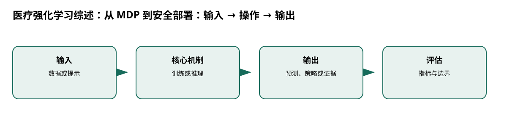

# 医疗强化学习综述：从 MDP 到安全部署

> 身份与版本：依据修正后的本地 PDF（arXiv 1908.08796v4）。原报告中若将主题替代论文写成同名原论文，已在本笔记和身份核对文件中明确标注。

## 核心信息
- 标题: Reinforcement Learning in Healthcare: A Survey
- 标题翻译: 医疗强化学习综述：从 MDP 到安全部署
- 作者: Chao Yu, Jiming Liu, Shamim Nemati
- 发表时间: 2019-08-22
- 发表渠道: arXiv / 论文版本见本地 PDF
- DOI: 未提供
- arXiv: [1908.08796v4](https://arxiv.org/abs/1908.08796v4)
- 论文链接: https://arxiv.org/abs/1908.08796v4
- 代码 / 项目: 未核实可直接复现本文的官方仓库
- 数据 / 资源: 见“数据与任务定义”
- 论文类型: 综述

## 原文摘要翻译
强化学习用环境交互和评价反馈学习行为决策，与依赖一次性监督信号的传统方法不同。序贯诊断和治疗过程具有延迟反馈，因此医疗是潜在应用领域。本文综述动态治疗、重症监护、自动诊断、资源调度、流程控制、药物研发和健康管理，并总结理论基础、方法、挑战与未来方向。

## 创新点
- **方法或组织贡献**：医疗 RL 的关键不是把任意预测任务命名为奖励，而是将真实序贯决策、反馈、可观测状态和安全约束定义清楚。
- **可复用部分**：MDP 为 $M=(S,A,P,R,\gamma)$，价值满足 $V^\pi(s)=E_\pi[\sum_t\gamma^tR_t|s_0=s]$。
- **边界提醒**：论文的结论只适用于下文的数据、任务和评估协议。

## 一句话总结
医疗 RL 的关键不是把任意预测任务命名为奖励，而是将真实序贯决策、反馈、可观测状态和安全约束定义清楚。

## 研究问题
医疗 RL 的关键不是把任意预测任务命名为奖励，而是将真实序贯决策、反馈、可观测状态和安全约束定义清楚。

## 数据与任务定义
综述对象覆盖医疗 RL 文献；理论形式为 MDP/POMDP、value/policy/model-based/offline RL；不提供单一训练数据集、模型或 GPU 需求（p.2–3）。

## 方法主线
### 机制流程

> 图：本文依据原文输入—机制—输出关系重绘；用于解释流程，不替代原论文结果图。

图中四个框分别对应原文的输入、变换/学习、输出和评估；箭头表达数据或证据的实际流向，不代表额外的因果保证。

1. **输入患者或系统状态、动作、转移和反馈**：输入患者或系统状态、动作、转移和反馈，形式化为 MDP/POMDP。
2. **选择模型学习、价值学习或策略搜索算法**：选择模型学习、价值学习或策略搜索算法，处理部分可观测和延迟奖励。
3. **用回顾性数据做 OPE**：用回顾性数据做 OPE，检查行为策略覆盖、混杂、稀疏奖励和不确定性。
4. **在前瞻验证前加入可解释性、先验知识、安全探索和监管审查。**：在前瞻验证前加入可解释性、先验知识、安全探索和监管审查。

### 模型、公式与关键实现
MDP 为 $M=(S,A,P,R,\gamma)$，价值满足 $V^\pi(s)=E_\pi[\sum_t\gamma^tR_t|s_0=s]$。综述强调离线评估易受行为策略估计、状态表示和混杂影响；安全探索不能把患者当可重置环境。

## 关键结果
没有统一性能表；领域共识是医疗 RL 面临小样本、部分可观测、延迟信用分配、可解释性和安全验证。对流感“预测准确率”而言，监督时序模型和概率评估仍更直接。

## 深度分析
综述提出解释策略、融合临床先验和小样本学习等未来方向。它支持建立风险清单，不支持任何特定算法在流感上有效。

### 与老年人流感预测的关系
[2, 3, 20, 21, 22, 23]

## 局限
综述发表于 2019，不能代表 2024–2026 的最新时序基础模型。医院流程、患者结局和政策约束存在外推风险。

## 我的笔记
- 先固定论文版本、数据发布日期、患者/地区时间切分和随机种子，再比较模型。
- 所有迁移实验同时报告总体与 65+、75+ 分层；预测模型报告 MAE/WIS、覆盖率、峰值误差和提前量。
- 医疗强化学习论文中的动作策略、代理奖励和 OPE 不能替代流感数值预测的概率损失；如引入决策，另建 CMDP 与安全评估。

## 引用
- 原始论文：[Reinforcement Learning in Healthcare: A Survey](https://arxiv.org/abs/1908.08796v4)，arXiv:1908.08796v4。
- 本地逐页证据：`../检索记录/24_pages.txt`；关键页码：['状态—动作—转移', 'MDP/POMDP'], ['价值 / 策略 / 模型', '处理延迟反馈'], ['离线评估', 'OPE + 混杂检查'], ['安全部署', '解释、先验、前瞻验证']。
